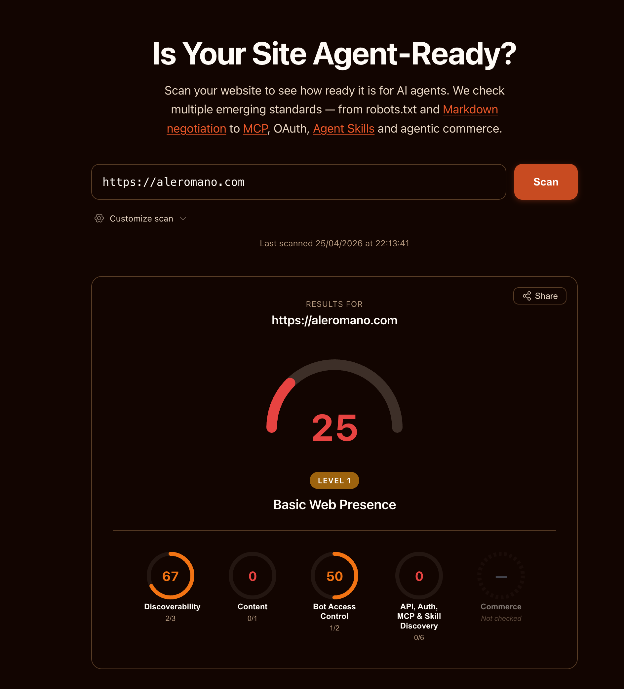
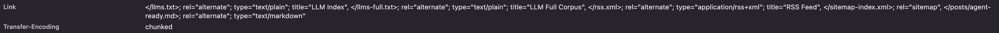

Here is something I already established in my [about this site presentation](/posts/about-this-site): the web has always been mostly bots. Port scanners, crawlers, feed readers, synthetic monitors. Humans are a minority in your server logs, and always have been.

What has changed is the quality of the bots. The old ones were indiscriminate: they would happily crawl anything and stuff it in an index. The new wave of AI agents is considerably more demanding. Perplexity, ChatGPT with browsing, Claude's web search, and hundreds of custom RAG pipelines now fetch web pages to build context for answering questions. And these agents, unlike their ancestors, have opinions: they would much rather receive clean markdown or plain text than dig through layers of HTML, navigation markup, and JavaScript bundles.

So the bots that were always there got smarter and started asking for a better experience. Rude of them, honestly. But fair.

I came across [Dennis Morello's article on configuring his site for AI discoverability](https://morello.dev/blog/configuring-my-site-for-ai-discoverability) and one line stuck with me:

> "If your site isn't readable by those agents, you don't exist to them."

That is blunt, accurate, and enough to spend a Saturday evening on this (it was the Festa della Liberazione, happy freedom to everyone!). Here are the **7 changes I made, reusable for any static or server-rendered site**.

## The Starting Point 📊

His article also pointed me to [isitagentready.com](https://isitagentready.com), a tool that scans your website and scores how well it is set up for AI agents. I ran it on aleromano.com.



25 out of 100. Level 1: Basic Web Presence. The site existed on the web, which counted for something, but not much more from an agent's perspective.

The breakdown was revealing:

- **Discoverability: 67** (2/3 checks) --> partial credit, mostly from having a sitemap
- **Content: 0** (0/1 checks) --> no machine-friendly content formats
- **Bot Access Control: 50** (1/2 checks) --> robots.txt existed but lacked AI-specific directives
- **API, Auth, MCP & Skill Discovery: 0** (0/6 checks) --> nothing

The site works fine for humans. But if an AI agent wanted to understand what this blog is about, it had to parse every HTML page, fight through navigation, scripts, and layout markup, and somehow extract the actual content. Wasteful, fragile, and often inaccurate.

I decided to fix it. Here is what I did.

## Content Signals in robots.txt 🤖

The simplest change first. The `robots.txt` vocabulary has expanded to cover AI-specific preferences beyond the traditional `User-agent` and `Disallow` directives.

I added one line:

```
Content-Signal: search=yes, ai-train=no, ai-input=yes
```

This tells crawlers: index me for search, don't use me for model training, but feel free to use my content as context when answering questions. The distinction between `ai-train` and `ai-input` matters. I am happy for my posts to help someone get a useful answer from a chatbot. I would rather not have them silently absorbed into a training dataset without attribution.

The spec lives at [contentsignals.org](https://contentsignals.org/) and is still evolving, but writing it costs nothing.

## Accurate Sitemap Dates 📅

My sitemap was using the current build date as `lastmod` for every page. Technically wrong: it told crawlers that every page was updated today, on every build. For a growing blog, that is noise.

I updated the sitemap to read the `pubDate` from each post's frontmatter and use that as `lastmod` instead. Now a post from 2022 correctly signals that it has not changed since 2022. Crawlers can decide whether to re-fetch based on accurate information.

The `@astrojs/sitemap` integration has a `serialize` hook for exactly this. A small change, but one that makes the sitemap actually meaningful as a freshness signal.

## Markdown Endpoints 📄

This is the most impactful change for AI consumers.

Every blog post now has a parallel URL ending in `.md` that serves the raw markdown source. `/posts/about-this-site` serves the full HTML page with navigation, styles, and scripts. `/posts/about-this-site.md` serves just the content, with `Content-Type: text/markdown`.

For an AI agent, parsing raw markdown is dramatically cheaper than parsing HTML. No DOM traversal, no selector guessing, no stripping nav elements and footer widgets. Just the text.

Implementing this in Astro meant creating a new endpoint file named `[...slug].md.ts`. The `.ts` extension is stripped by Astro's router, leaving `.md` as the route suffix. The handler grabs `post.body` from the content collection and returns it. Around ten lines of code.

The best part: this comes essentially for free. I already write every post in markdown. The endpoint just exposes what is already there, with no conversion, no preprocessing, no extra tooling.

Italian translations get their own `.md` endpoints too, at `/posts/it/slug.md`.

## Advertising the Markdown URLs 🔗

Having the endpoints is half the job. The other half is making sure agents can discover them without already knowing they exist.

I added two layers of advertisement.

**In the HTML `<head>`:**

```html
<link rel="alternate" type="text/markdown" href="/posts/about-this-site.md" />
```

Any agent that fetches the HTML and reads the head finds the markdown alternative immediately.

**In HTTP response headers:**

```
Link: </posts/about-this-site.md>; rel="alternate"; type="text/markdown"
```

This is more powerful: the information is available before the HTML body is even parsed. Per [RFC 8288](https://www.rfc-editor.org/rfc/rfc8288), `Link` response headers are the right mechanism for advertising resource relationships at the HTTP layer.

I extended the existing Astro middleware (already used for admin auth) to append `Link` headers on every response. Blog post pages get the post-specific markdown link. All pages get global links pointing to the RSS feed, sitemap, and LLM index files.



## llms.txt and llms-full.txt 📚

A [growing convention](https://llmstxt.org/) in the AI-friendly web is to publish an `llms.txt` file at your site root. Think of it as a robots.txt for AI consumers: a plain-text index that gives agents a map of your content without making them crawl every page individually.

I implemented two variants:

**`/llms.txt`** is a structured index listing every English post with its title, description, and a direct link to the `.md` endpoint:

```
# Alessandro Romano

> Alessandro Romano's thoughts.

## Blog Posts

- [Making My Site Agent-Ready](/posts/agent-ready.md): How I went from...
- [My Friend Stress-Tested My Website](/posts/friend-stress-tested-my-website.md): A story about...
```

**`/llms-full.txt`** is the complete corpus: every post's full markdown concatenated into one file, separated by dividers with a header per post. Useful for agents that want comprehensive context without making dozens of individual requests.

Italian translations are intentionally excluded from both files. They are translations of existing English content and would just be duplicate material in AI corpora.

## Agent Skills Discovery Index 🗂️

A newer and still-evolving convention: a machine-readable file at `/.well-known/agent-skills/index.json` listing what AI-relevant capabilities your site exposes. The spec is a Cloudflare draft RFC ([agentskills.io](https://agentskills.io)).

Mine lists four entries: the LLM index, the full corpus, the RSS feed, and the sitemap. It is a single static JSON file with essentially zero maintenance cost.

Early days for this spec, but publishing it is trivial and any agent implementing the convention can discover the site's capabilities without heuristics.

## Structured Data (JSON-LD) 🏷️

Every blog post now includes a `BlogPosting` JSON-LD block in the `<head>`. This gives agents structured, typed metadata: word count, reading time, publication date, the article body as plain text, author identity with their areas of expertise, and a breadcrumb trail.

I was not hallucinating when I thought there was already some JSON-LD on the site. The `/about` page has had a `Person` schema for a while. The `BlogPosting` schema for individual posts was the missing piece.

The infrastructure was already in place in the `SEO` component: it accepted a `structuredData` prop and rendered it as a script tag. I just had to build the right object in `BlogPostLayout` and pass it in. The `author.knowsAbout` list reuses the same values from the `Person` schema on the about page, keeping things consistent.

## What I Deliberately Skipped ❌

The audit also flagged several things I chose not to implement.

**API Catalog (RFC 9727):** The site has no public API. The `/api/` routes are all internal (analytics, contact form, rate limiting). Publishing an API catalog for internal endpoints would be misleading.

**OAuth and protected resource metadata:** Admin access uses HTTP Basic Auth. No OAuth anywhere. Not applicable.

**MCP Server Card:** The spec is still an open draft PR. The site does not expose an MCP server, so there is nothing to advertise. Premature.

**WebMCP (`navigator.modelContext`):** WebMCP lets a page expose tools and actions to an in-page AI model. A blog has no meaningful actions to expose: there is nothing for an agent to do here besides read. Content discovery is already handled by llms.txt, so WebMCP would add nothing.

**`Accept: text/markdown` content negotiation:** Some implementations serve markdown when a request includes this header. The static `.md` URL approach covers the same use case without the complexity of content negotiation and is far easier to cache.

## Was It Worth It? 🤔

The traffic from AI agents crawling this site is not something I can measure precisely. Most of it looks like ordinary HTTP traffic without distinctive user agents.

But I think about it differently. The web has always adapted to how content gets consumed. We added RSS for feed readers. We added Open Graph tags for social previews. We added structured data for search result snippets. AI agents are the next layer of consumer, and the investment to support them is genuinely small: a few endpoint files, a couple of response headers, two text files, and a JSON blob.

The before score was 25. I will update this post with the after score once the changes are live on the production site.
