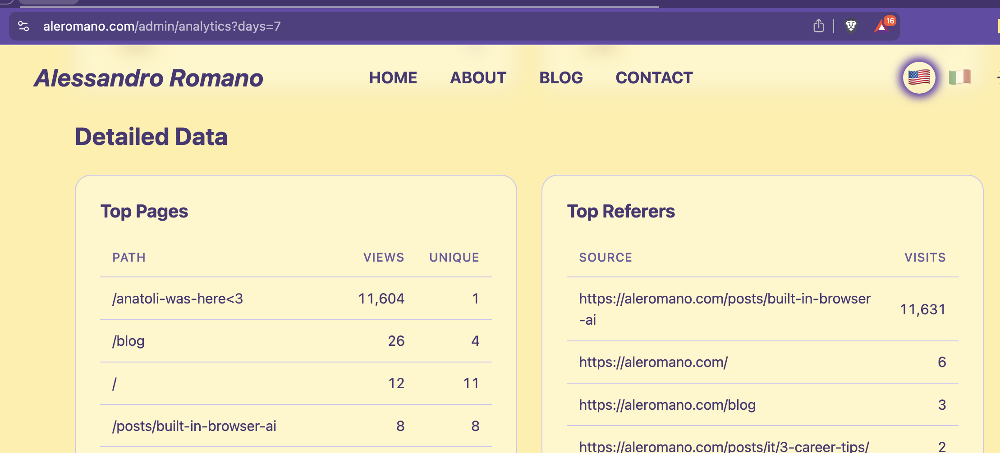
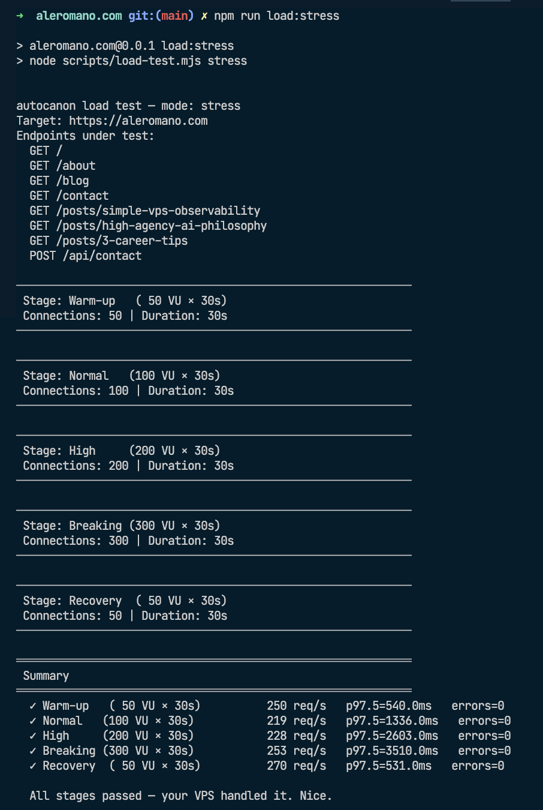
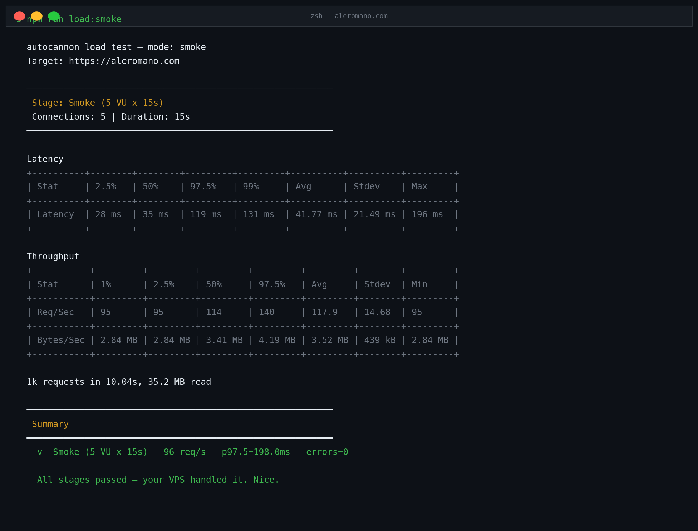
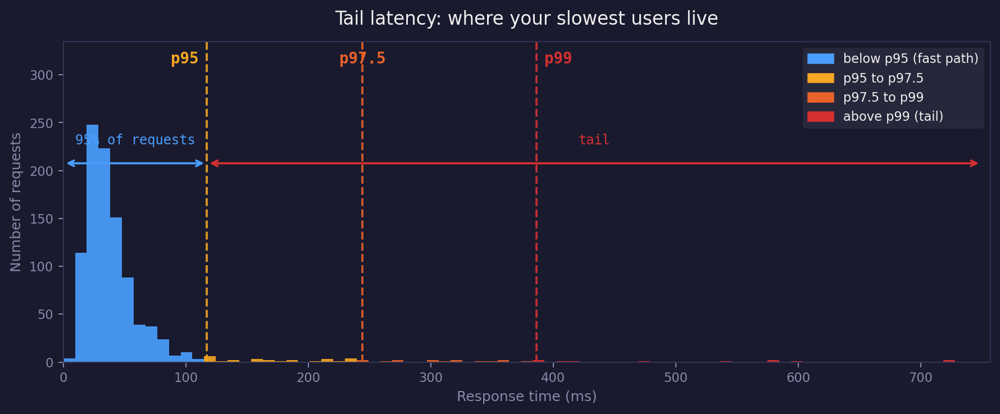
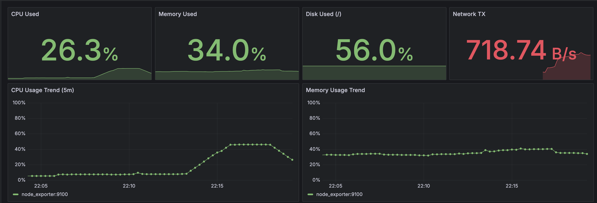

I was doing my usual check of my analytics dashboard when I noticed something strange.

The top page for the week was `/anatoli-was-here<3`, with **11,604 views** and a single unique visitor. A blog post I had never written. A path that didn't even exist on my site. And apparently, every single one of those 11,604 requests came from the same source: `https://aleromano.com/posts/built-in-browser-ai`.

I stared at this for a good thirty seconds before my brain connected the dots.



Then I sent a message to [Anatoli Nicolae](https://anatolinicolae.com/). One of those colleagues you genuinely go to the office just to see, the kind of person who makes a random Tuesday feel worth the commute. Sharp, funny, endlessly curious, and apparently running `k6` load tests against my website at full tilt without mentioning it first. 😅

He confirmed he wasn't trying to DDoS me, just experimenting with `k6`. He later sent me his script with the cheerful energy of someone who had just done me a massive favour. Which, honestly, he had.

## What He Did 🧪

Anatoli ran a `k6` load test that ramped from 20 to 100 virtual users over about three and a half minutes, each hitting my analytics collect endpoint with a custom path. The `/anatoli-was-here<3` marker was his way of signing his work. The analytics system is something I built myself; if you're curious how it works, I covered it in detail in [this slide of my DIY in the AI era talk](/posts/about-this-site/present#/25).

The result? Two things, actually. The good news ✅: my site handled it. The VPS didn't buckle, the response times stayed within acceptable bounds. But I had never actually *verified* any of that myself. I had deployed my site, tuned it a bit, added observability, and then just assumed it would hold up under pressure. Anatoli's unannounced stress test was the first real proof I had that it would.

The bad news ❌: the analytics endpoint accepted whatever data Anatoli threw at it, no questions asked. Any path, any payload. That's how `/anatoli-was-here<3` ended up as my most visited page of the week.

I patched this in `nginx`. The analytics collect endpoint now has its own rate-limiting zone 🔒:

```nginx
limit_req_zone $binary_remote_addr zone=ANALYTICS:10m rate=30r/m;

location = /api/analytics/collect {
    limit_req zone=ANALYTICS burst=20 nodelay;
    limit_req_status 429;
    # ... proxy to app
}
```

The `rate=30r/m` part is the steady-state limit: at most 30 requests per minute from any single IP. That works out to one request every two seconds on average. A real person clicking around your site (opening a post, navigating to the home page, reading another article) sends maybe a handful of analytics pings per minute. 30 is generous.

But there is a problem with a hard per-second rate limit: legitimate traffic is bursty. You open a tab, your browser fires three requests almost simultaneously. Or you click through a few links quickly. If nginx enforced exactly one request every two seconds with no tolerance, those bursts would trigger false positives and drop real users.

That is what `burst=20` handles. Think of it like a token bucket: nginx gives each IP a bucket that holds 20 tokens. Every request spends one token. Tokens refill at the configured rate (30 per minute, so one every two seconds). If you fire 5 requests at once, that is fine: you spend 5 tokens and the bucket still has 15 left. If you fire 25 requests at once, the first 20 are accepted (bucket drained), and the remaining 5 get a 429. The `nodelay` flag means nginx does not queue them up and drip them through slowly; it either serves them immediately or rejects them.

So a real user navigating the site will never hit this limit. A flood script hammering the endpoint at hundreds of requests per minute will exhaust the burst in the first second and get blocked for the rest.

It does not prevent someone from crafting a slow trickle of fake paths (rate limiting is not input validation), but it does stop the kind of unthrottled hammering Anatoli's test demonstrated. The app-level origin check is a separate layer that handles the rest.

## Why Load Testing a Personal Site Still Matters 🏋️

It's tempting to think load testing is only for companies with millions of users and dedicated SRE teams. But even for a personal site on a VPS, it matters for a few concrete reasons:

- **You don't know your limits until you hit them.** A site that feels fast with 1 user might struggle badly with 50 concurrent ones. Without testing, that discovery happens in production, at the worst possible moment.
- **VPS resources are fixed.** Unlike cloud auto-scaling, a single Hetzner box has a ceiling. If you write a blog post that gets shared on Hacker News, you want to know ahead of time whether your server will survive the traffic spike.
- **Regressions happen silently.** A database query you added, a third-party call you introduced: any of these can quietly degrade performance. Regular load tests catch this before users do.
- **It gives you confidence.** There is something genuinely calming about knowing your site has been hammered with 100 concurrent connections and came out fine.

## Types of Tests You Should Know 📚

Before picking a tool and running it, it helps to understand what you are actually measuring.

**Smoke test**: the minimum viable check. A handful of virtual users for a short burst, just to confirm nothing is obviously broken. Run this after every deploy.

**Load test**: a sustained simulation of realistic traffic. You define a target number of concurrent users and hold it for long enough to reveal memory leaks, connection pool exhaustion, or response time degradation under steady pressure.

**Stress test**: you push beyond your expected ceiling to find the breaking point. The goal is not to pass; it is to discover *where* you fail and *how gracefully*.

**Soak test** (also called endurance test): you hold a moderate load for a long time (hours, sometimes days). This is the one that catches slow memory leaks and database connection drift that only appear over time.

For a personal site, smoke and load tests are the essential two. Stress testing is valuable if you are about to do something that might drive a traffic spike (a product launch, a conference talk, getting posted on a popular aggregator).

## Setting It Up with `autocannon` ⚙️

[autocannon](https://github.com/mcollina/autocannon) is a Node.js HTTP benchmarking tool built by [Matteo Collina](https://github.com/mcollina), one of the most prolific contributors to the Node.js ecosystem. It is fast, scriptable, and installs as a regular npm package, which means no separate binary to manage.

```bash
npm install --save-dev autocannon
```

The simplest possible test from the command line:

```bash
npx autocannon -c 50 -d 30 https://yoursite.com
```

`-c 50` means 50 concurrent connections. `-d 30` means run for 30 seconds. That is already more useful than nothing.

But the real power comes from using the JavaScript API, which lets you script stages, rotate between multiple endpoints, and build a summary report:

```js
import autocannon from 'autocannon';
import { promisify } from 'util';

const run = promisify(autocannon);

async function runStage({ connections, duration, label }) {
  const result = await run({
    url: 'https://yoursite.com',
    connections,
    duration,
    requests: [
      { method: 'GET', path: '/' },
      { method: 'GET', path: '/about' },
      { method: 'GET', path: '/blog' },
    ],
    title: label,
  });

  autocannon.printResult(result);
  return result;
}

// Ramp up like a real traffic spike
await runStage({ connections: 20,  duration: 30, label: 'Ramp-up' });
await runStage({ connections: 50,  duration: 60, label: 'Sustained' });
await runStage({ connections: 100, duration: 30, label: 'Peak' });
await runStage({ connections: 20,  duration: 30, label: 'Cool-down' });
```

I added three commands to my own `package.json`:

```json
"load:smoke":  "node scripts/load-test.mjs smoke",
"load:test":   "node scripts/load-test.mjs load",
"load:stress": "node scripts/load-test.mjs stress",
```



Each mode runs a different set of stages. `smoke` is fifteen seconds and five connections, just enough to confirm the site is alive. `load` replicates roughly what Anatoli ran. `stress` goes further, pushing to 300 concurrent connections to find where things start to degrade.

## One Thing to Watch Out For ⚠️

If you are testing a POST endpoint that triggers side effects like sending emails, writing to a database, or charging a credit card, make sure your test payload is designed to fail validation quickly. For my `/api/contact` endpoint, I pass a deliberately invalid `reason` field so the server returns a fast `400` without ever touching the mail transport.

## Reading the Results 📊

`autocannon` prints a table after each stage. Here is what it looks like for a smoke run against this very site:



The numbers to focus on:

- **Req/s** (requests per second): your throughput. Higher is better.
- **Latency p95 / p97.5 / p99**: percentile latencies. Take all your requests, sort them from fastest to slowest, then read off the value at that position. p95 = the response time at position 950 out of 1000. p99 = position 990. The average hides the slow outliers; percentiles expose them. This is called *tail latency*: the long, thin end of the distribution where a small percentage of users are waiting much longer than everyone else.

  

  A p99 above 1000ms means 1 in every 100 visitors waited over a second. 
- **Errors / Timeouts**: any non-zero value here deserves immediate attention. These mean your server is dropping or refusing connections.

On the VPS side, watch `htop` or `docker stats` during the test. You are looking for CPU hitting 100% and staying there (a bottleneck), memory growing and not releasing (a leak), and connection count approaching your configured limits.



The CPU trend tells the story clearly: flat baseline, a visible climb as the load ramps up, then recovery once the test ends. Memory stayed stable throughout. No leak. If that CPU line had touched 100% and stayed there, that would be the signal to investigate.

## What I Took Away from All of This 💡

Anatoli did not just run a load test. He demonstrated something I already knew intellectually but had not actually done: you cannot trust your site's resilience without evidence. Assumptions are not SLAs.

The automation is straightforward. The tooling is excellent. There is no good reason to wait for a friend to surprise you with 11,604 requests before you start paying attention to how your site behaves under pressure.

Run the smoke test after every deploy. Run the load test before anything you expect to drive traffic. And if your analytics ever show a path called `/your-friend-was-here`, consider it a gift.


> *Thanks, [Anatoli](https://www.linkedin.com/in/nicolae/). I appreciate you flooding my website with your ~~Spritz~~ Scripts. See you at the office.*

