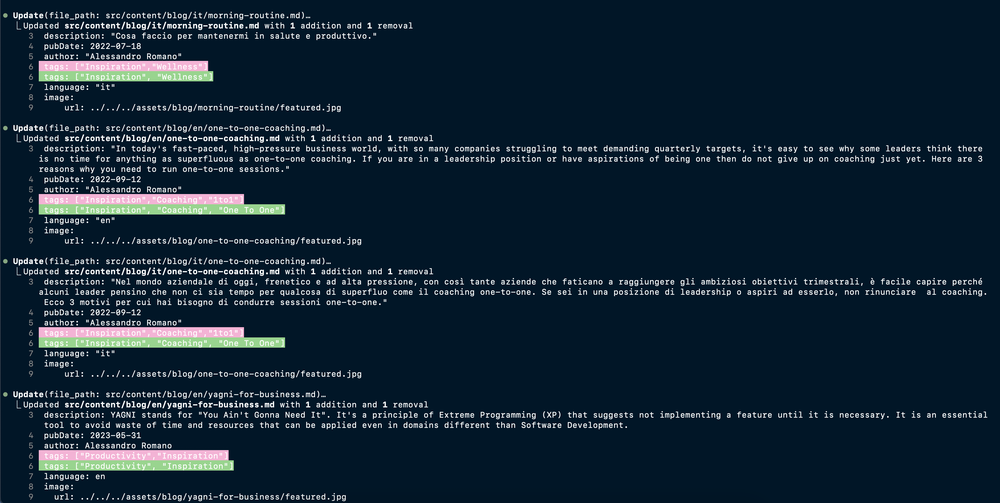

You know those small tasks that keep moving from one to-do list to the next? For months I've been meaning to fix the inconsistent tags on my blog but kept pushing it off. I had a perfect storm of messy tags - different formats, random abbreviations, and duplicate concepts across posts. Last weekend, I finally tackled it, but with a twist: I enlisted the help of Claude, an AI coding assistant.

## My Blog Tag Problem

As my blog grew over time, my tagging system became increasingly inconsistent:

- Inconsistent formatting: `remote-work` vs `Remote Work` vs `remoteWork`
- Overlapping concepts: `DX` and `Developer Experience` used interchangeably
- Abbreviated tags that weren't obvious to readers
- Inconsistent translations between Italian and English versions of posts

This made it difficult for readers to find related content and complicated my own content management.

## Enter Claude Code

[Claude Code](https://www.anthropic.com/claude) is Anthropic's AI coding assistant. It can analyze codebases, suggest improvements, and implement changes across multiple files. I decided to see if it could handle my tag refactoring task.

Here's how the process went:

1. **Analysis**: Claude scanned my entire blog repository, analyzing all posts in both English and Italian to understand the existing tag patterns
2. **Tag standardization plan**: It identified inconsistencies and suggested PascalCase with spaces as the best format
3. **Implementation**: Claude updated all blog post tags across the codebase in a consistent manner
4. **Enhanced organization**: It even created utility functions to group related tags

## The Results

Here's what the tag transformation looked like for some posts:

- `["Tech","DX", "Productivity"]` → `["Tech", "Developer Experience", "Productivity", "Tools"]`
- `["Productivity","Async Work"]` → `["Productivity", "Remote Work", "Leadership"]`
- `["Wellness","DX","Tech","Inspiration"]` → `["Wellness", "Developer Experience", "Tech", "Inspiration"]`
- `["Inspiration","Coaching","1to1"]` → `["Inspiration", "Coaching", "One To One"]`

Beyond just reformatting, Claude suggested semantic improvements, expanding abbreviations, and ensuring consistent tag usage across related posts.

## Beyond Just Fixing Problems

The impressive part wasn't just that Claude fixed the tags, but that it understood the broader context of what I was trying to achieve. It spotted patterns I hadn't explicitly mentioned and suggested improvements I hadn't considered.

My favorite was when it recognized that "DX" is actually "Developer Experience" and consistently made this change across all posts, making my content more accessible to readers who might not know all the tech abbreviations.

## Why This Matters

Taking the time to clean up tags significantly improves the user experience for my readers. They can now:
- Discover related content more easily
- Navigate between topics more intuitively
- Find consistent terminology between English and Italian posts

## The AI Coding Experience

The whole process felt surprisingly natural - like working with a really fast colleague who never gets bored with repetitive tasks. Instead of tediously opening file after file to fix tags, I just explained what I wanted in plain language and reviewed the results.

I was particularly impressed by how Claude:
1. Figured out my codebase structure without me explaining it
2. Made consistent changes across all posts (at least 20 files)
3. Didn't just blindly follow instructions but suggested better approaches
4. Balanced technical correctness with conceptual organization

It reminded me of my [Mac to Windows transition](/posts/mac-to-windows) where the right tools turned a dreaded change into something actually enjoyable.

## Conclusion

Using Claude Code to refactor my blog's tagging system saved me hours of tedious work. More importantly, it produced a better result than I likely would have achieved manually, with added utilities for maintaining consistency in the future.

If you have a similar refactoring task that has been lingering on your to-do list, consider giving an AI coding assistant a try. Just be clear about what you want, review the changes, and you might be surprised by the results.

The future of web development certainly involves this kind of human-AI collaboration, combining your domain expertise with AI's ability to handle repetitive tasks with consistency and attention to detail.

> This post was written with the help of Claude Code, the same AI assistant that helped me refactor my tags. I simply asked it to document the process we just completed, and it drafted this post based on our conversation. Talk about dogfooding!