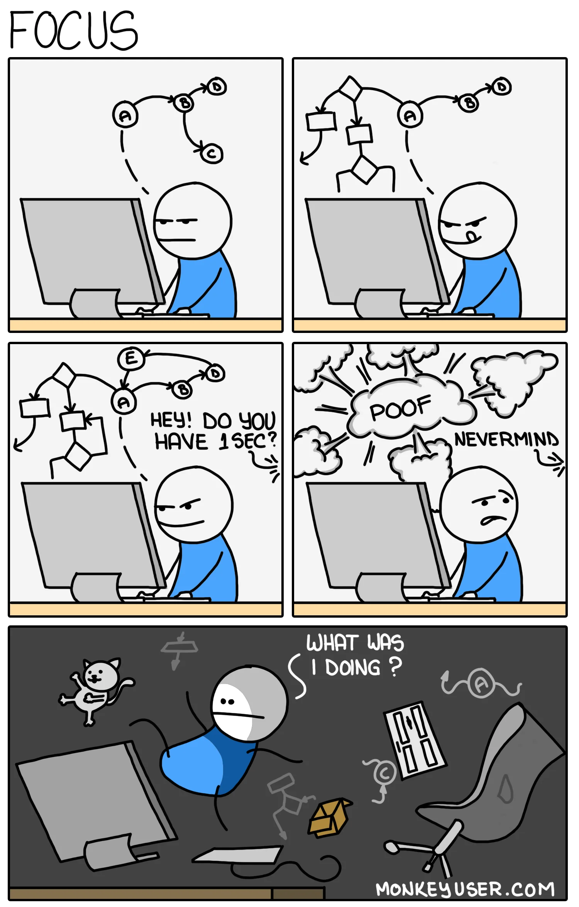
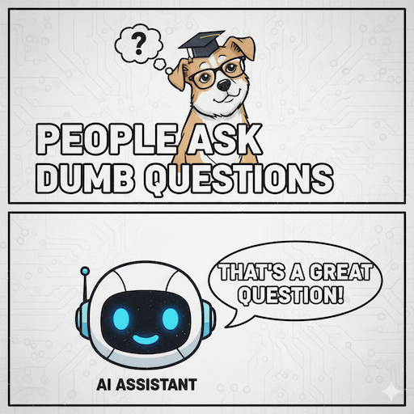

It's Saturday afternoon. After a nice seafood spaghetti lunch, my wife and I put the kids down for a nap. Two uninterrupted hours to work on my site! Ten minutes later... "Dad, I need to poop!" End of focus and, until a few months ago, end of my motivation to write code.

At work I'm not interrupted by sentences like that, but as an Engineering Manager for 3 teams, developing people occupies most of my time, with continuous context switches and ad‑hoc chat requests.

Don't get me wrong: **I love my job as a manager and I love being a father**. But I also love writing code and designing software. Trying to stay sharp as a developer under these conditions was a challenge I kept losing, until about a year ago.

## AI-Assisted Development (no, I don't do vibe coding) 🤖

I've seen first-hand how important uninterrupted blocks of time are for a Software Engineer because writing code requires deep focus.

This concept [isn't new](https://www.paulgraham.com/makersschedule.html), but it's too often forgotten, especially by those who schedule meetings right in the middle of a morning or afternoon (and [maybe they're not even effective](/posts/effective-meetings-agenda)).

Then **AI-assisted development** arrived.

When Emma was born I used my month of parental leave to [rebuild this site](/posts/about-this-site) using Astro, TypeScript and Docker, technologies I only superficially knew or hadn't used actively in a while.

I started with Cursor, though now I mostly use GitHub Copilot in VS Code in *Agent* mode.

Let me stop you right away: I don't do *vibe coding*. Every piece of code produced is reviewed, sometimes modified, and always **understood** by me. If something's unclear I switch to *Ask* mode and keep asking questions until I understand the reasoning behind the choices.

So, Sonnet & Co. didn't "build the site for me"; it allowed me to develop consistently even though I was rusty on TypeScript syntax and didn't fully know Astro and Docker, while an unexpected diaper change or my other child's desire to play interrupted the workflow.

## It Feels Like I'm Programming in "English" ✍️

I had a big AHA moment when I started dictating my prompts using the microphone icon in VS Code.

> "I want to build a section of the site listing my most recent posts from X. The API call must happen server-side so the page using this component should be server-side rendered. Split responsibilities into a function handling the REST call, one applying a caching layer, and one adapting data for rendering in a pure presentation component with no logic. Expect the API key as a secret from the environment. Write unit tests for these components. Ask me clarifying questions if you need more detail."

That's similar to the prompts I use (though recently I added a template in the [copilot-instructions.md](https://github.com/aleromano92/aleromano.com/blob/main/.github/copilot-instructions.md)).

I remain the primary expert on the system: I guide design, request certain patterns, communicate functional and cross-functional requirements. I launch the prompt and go do what my team or my family needs. When I return I find a *diff* ready and can quickly validate whether the output matches the intention; otherwise I refine the prompt or tweak things manually.

Effectively, instead of giving the "computer" TypeScript as input, I'm writing in a **higher-level language**: English.

Obviously I do NOT generate commit messages with AI, I write the *why* myself ([here I explain why that's important](/posts/git-commits-why)).

## ~~Prompt~~ Context Engineering: it's like working with a Junior 🎯

"Prompt engineering" is a misleading expression: you're not engineering a prompt; you're **providing context** to an assistant helping you accomplish a complex task. It's honestly not that different from onboarding a (particularly junior) new hire when asking them to build their first features:

- Provide as much business context as possible so decisions align with goals
- Share examples of similar tasks such as past PRs or code areas to mirror
- Ask them to proceed in small steps so you can course-correct early
- Stay open to clarifying further doubts

The **quality of the output** depends on the skill of whoever performs the task, but also on how context is provided: like with ML models, *garbage in = garbage out*.

Another way to improve output quality? **You write the unit tests.** Allow the Agent to run the test command (like `npm test`) automatically until they pass. In the end, tests are an extremely precise way to encode requirements.

## Risks and Caveats ⚠️

I don't think _"I copied from StackOverflow"_ is much different from _"the AI wrote the code for me"_. The real difference is always your __degree of understanding__ of the code pasted (or generated).
Before, with some StackOverflow answers, you might risk rude responses, now you can use an LLM to explain the why behind every choice. And trust me: it'll always tell you it's a great question. It wasn't safe to paste code without understanding before; it's not safe to do vibe coding now.

Some say they're worried that writing less code will erode **muscle memory**, especially around syntax. That's potentially true, just like since digital maps exist our orientation skills have degraded. But we don't stop using maps because the overall benefit massively outweighs the cost.

And several studies confirmed that [learning improves when writing by hand](https://pmc.ncbi.nlm.nih.gov/articles/PMC11943480/), yet I (thankfully) don't see anyone writing programs on paper anymore like in high school 😁

It's important though to be aware of how dependent we already are. If I were deprived of AI today, I'd struggle to be as productive as I am now.

### If You're a Junior 👶

If you haven't mastered fundamentals like:

- Data structures
- End-to-end flow of a web request
- Design patterns
- Inheritance vs composition
- Storage systems (databases, caches, buckets)

AI will make you go fast on a *road whose signs you haven't read*.

Long-term risks:

- Difficulty debugging
- Lack of architectural *taste* (knowing what's over-engineered)
- Poor readability
- Misunderstanding how complex systems work (not even necessarily distributed)

I wouldn't ban it, but you must use it to **learn**, not to speed past the basics. Computer Science is still young, you still have time to understand how an x86 CPU and its registers work before jumping back up to high-level things like Docker.

## Conclusion 💡

I realized AI-assisted development also has an emotional benefit: even with a packed schedule (work and family), I can touch my site, or work projects, almost every day. That creates continuity which fuels motivation and satisfaction. I've rediscovered the joy of writing code. 🤗

Even as a Senior Engineering Manager overseeing multiple teams including other managers, I still believe staying hands-on as a developer makes me more effective in my role.
