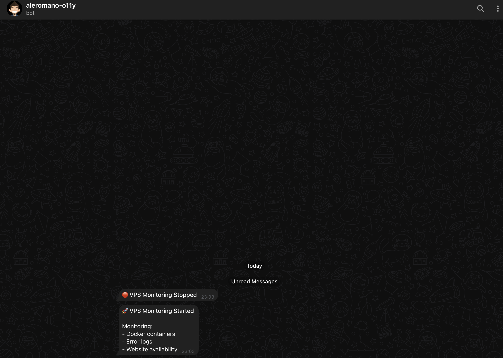
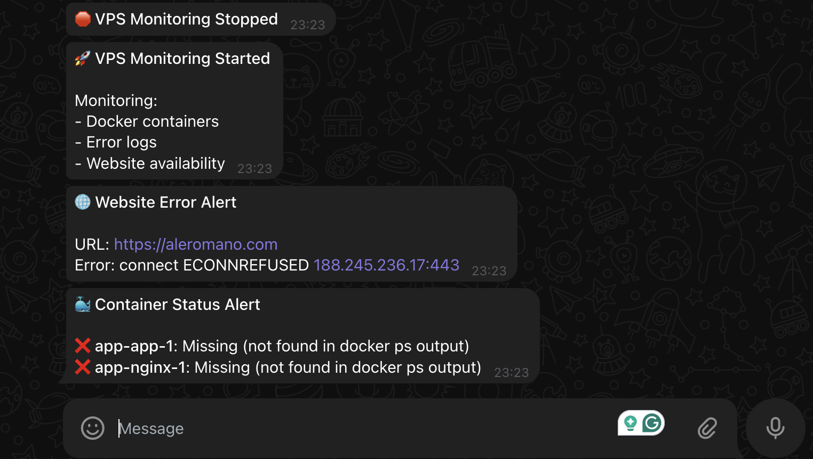

Setting up a personal website is just the beginning. Keeping it running smoothly is the real challenge. I've learned this the hard way: nothing's more frustrating than discovering your site has been down for hours (or days!) because you didn't have a monitoring system in place. 🤦‍♂️

Let me share the lightweight observability solution I've implemented for my personal website. It's simple, effective, and doesn't require expensive tools or complex setups.

## Why I Didn't Need Enterprise Monitoring 🔍

For personal websites or small projects, those fancy enterprise-grade monitoring solutions that cost hundreds of dollars monthly are overkill. But you still need to know when something breaks. The key is finding the right balance.

My approach focuses on three critical aspects:

1. **Container Status Monitoring**: Is Docker running my containers? 🐳
2. **Error Log Detection**: Are there hidden errors I should know about? 📋
3. **Website Availability**: Can visitors actually see my site? 🌐

This lightweight approach gives me peace of mind without the complexity of more sophisticated solutions.

## The Solution: A Simple Node.js Daemon ⚙️

I've created a Node.js daemon that runs as a systemd service on my VPS. It performs regular checks and sends notifications via Telegram when issues are detected.



### Key Components

#### 1. Container Status Monitoring

The script regularly checks the status of Docker containers using the `docker ps` command. If any monitored container stops running, I get an immediate alert:

```javascript
const checkContainerStatus = () => {
    exec('docker ps -a --format "{{.Names}}|{{.Status}}"', (error, stdout, stderr) => {
        // Process container statuses and send alerts for stopped containers
    });
};
```

#### 2. Error Log Detection

The daemon scans Docker logs for error messages, exceptions, and fatal errors. This helps me catch issues before they escalate:

```javascript
const checkDockerLogs = () => {
    // For each container
    exec(`docker logs --since ${since} ${containerName} 2>&1 | grep -i "error\\|exception\\|fatal"`, (error, stdout, stderr) => {
        // Send alerts if errors are found
    });
};
```

#### 3. Website Availability Checks

Regular HTTP requests verify that my website is accessible and responding properly:

```javascript
const checkWebsite = () => {
    const request = https.request(options, (response) => {
        const responseTime = Date.now() - startTime;

        if (response.statusCode >= 200 && response.statusCode < 400) {
            log(`Website is up. Status: ${response.statusCode}, Response time: ${responseTime}ms`);   
            // ...
    
    // Handle timeouts and errors
};
```

### Notifications via Telegram

All alerts are sent to Telegram, so I get real-time notifications on my phone or desktop:

```javascript
const sendTelegramNotification = async (message) => {
    const { botToken, chatId } = CONFIG.telegram;
    const url = `https://api.telegram.org/bot${botToken}/sendMessage`;

    // Send formatted HTML message to Telegram
};
```

## Real-World Monitoring in Action 🚨

When everything is running smoothly, the daemon performs its checks silently in the background. But when something goes wrong—like when Docker containers stop—the system springs into action:



In this example:

1. The monitoring system detected that the Docker containers were stopped
2. It immediately sent a notification with details about which containers were affected
3. It also detected that the website was unreachable as a result
4. The HTML formatting makes the alerts easy to read at a glance

This real-time feedback allows me to quickly fix issues, often before visitors even notice them.

## Why This Approach Is Enough for Me ✅

### 1. Focused on What Matters

My solution covers all these bases without unnecessary complexity.

### 2. Low Resource Consumption

The monitoring daemon uses minimal CPU and memory resources, making it perfect for running alongside my website on the same VPS without impacting performance.

### 3. Zero External Dependencies

Unlike SaaS monitoring solutions, this approach doesn't rely on external services that might introduce additional costs or points of failure. Everything runs on my own infrastructure.

### 4. Immediate Notifications

When something goes wrong, I know immediately through Telegram notifications, allowing me to address issues promptly.

### 5. Easy to Extend

The modular design makes it easy to add additional checks or modify existing ones as my needs evolve.

## Implementation Challenges and Solutions 🛠️

During implementation, I encountered and solved several common challenges:

### 1. Duplicate Logging

Initially, I noticed duplicate log entries because systemd was redirecting both stdout and stderr to the same log file. I fixed this by modifying the logging function:

```javascript
const log = (message, level = 'INFO') => {
    // Only log to console if we're not also logging to a file
    if (!CONFIG.logFile || process.env.NODE_ENV === 'development') {
        console.log(logMessage);
    }
    
    // Log to file if specified
    if (CONFIG.logFile) {
        fs.appendFileSync(CONFIG.logFile, logMessage + '\n');
    }
};
```

### 2. Website Timeout Issues

I enhanced the website check to handle timeouts more gracefully and added a fallback check using curl to verify if the issue was with my monitoring or with the website itself:

```javascript
request.on('timeout', () => {
    // Try a simple curl command to see if the website is reachable
    exec(`curl -s -o /dev/null -w "%{http_code}" -m 10 ${CONFIG.website.url}`, (error, stdout, stderr) => {
        // Compare results and send appropriate notification
    });
});
```

### 3. HTML Formatting in Notifications

I fixed issues with HTML formatting in Telegram messages by properly configuring the API request:

```javascript
const postData = new URLSearchParams({
    chat_id: chatId,
    text: message,
    parse_mode: 'HTML'
}).toString();
```

## Installation and Setup 📦

The solution includes an installation script that:

1. Checks for Node.js and installs it if necessary
2. Prompts for Telegram bot token and chat ID
3. Sets up a log file with proper permissions
4. Creates and configures a systemd service
5. Starts the monitoring daemon

This makes deployment straightforward even if you're not a Linux expert.

## Get the Complete Solution 📂

The complete solution, including the monitoring script, installation script, and documentation, is available on my GitHub repository. Feel free to use it, fork it, or adapt it to your own needs:

[github.com/aleromano92/aleromano.com/tree/main/scripts/observability](https://github.com/aleromano92/aleromano.com/tree/main/scripts/observability)

I've made everything open source so you can benefit from my experience and avoid the same challenges I faced. If you have any improvements or suggestions, pull requests are welcome!

## Conclusion

The goal of observability for a personal website isn't to collect every possible metric, but to ensure you know when something needs your attention. This solution accomplishes that goal elegantly and efficiently. 🎯
