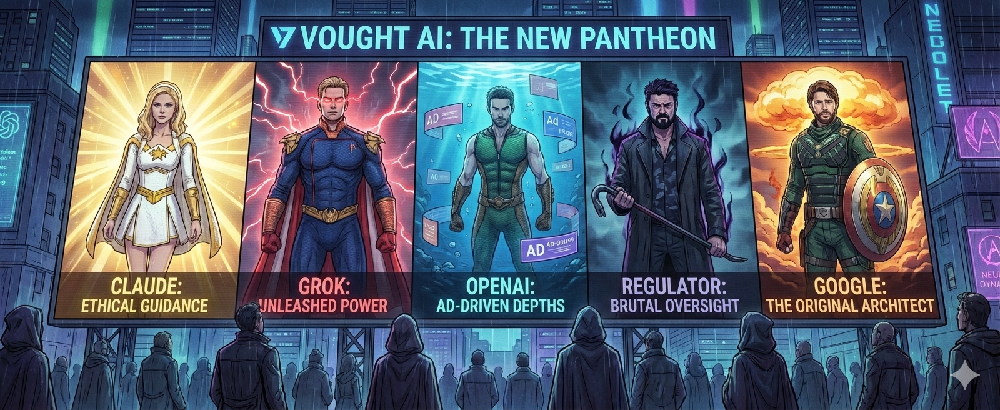

The inspiration for this post comes from reading Dario Amodei's essay, [The Adolescence of Technology](https://darioamodei.com/essay/the-adolescence-of-technology). The first section of the essay focuses on factually analyzing the true risks that AI can bring. And no, it's not the disappearance of some jobs, or at least these are not the most imminent or catastrophic dangers. The major risks are linked to potential biological damage that can be realized with the next generation of models.

## The Parallel with The Boys 💉

There is a sentence in the essay that struck me particularly:

> "To put it another way, renting a powerful AI gives intelligence to malicious (but otherwise average) people."

This statement immediately made me think of the comic and TV series *The Boys*, where a private company, Vought International, gave superpowers to normal people through a chemical compound (Compound V). The result? "Douchebag" superheroes who abuse their powers or, worse, create real disasters. In particular, the comic tells of some episodes where Vought pressured the government to insert superhumans into military operations. The outcome was a true disaster, with unspeakable loss of human life, because the superheroes were absolutely not trained for war and its rules, bringing only chaos and collateral destruction.

## The Super-AI Cast 🦸‍♂️ 🦸‍♀️ 🧔‍♂️ 🦹‍♂️ 🦹‍♂️

Before returning to examine what we could do to avoid such a scenario coming true, allow me to add another level to this parallel. This time between the "Supes" of The Boys and current AI models:

*   **Homelander is Grok**: Anarchic, incredibly strong, and without inhibitions. He is not afraid to go beyond limits, with all the destructive consequences that entail. He represents power without control and a total lack of ethical responsibility.
*   **Starlight is Claude**: She realizes the huge problem that "superheroes" pose and wants to collaborate with institutions to put a brake on their overpowering presence. She tries to do the right thing from the inside, pushing for safety and ethics.
*   **The Regulator is Butcher**: Having waited too long to take countermeasures, now risks having to resort to "violence" (metaphorically, draconian laws or total bans) and the most brutal methods to restore order. If politics sleeps, the awakening will be abrupt and brutal like Billy Butcher.
*   **The Deep is OpenAI**: Don't get me wrong OpenAI, but the recent announcement of putting ads in its responses reminded me of the lost Deep. Once part of the "Greats/The Seven", now he seems to desperately try to remain relevant or profitable, sometimes with moves that leave one perplexed.
*   **Soldier Boy is Gemini**: Just as Soldier Boy was the number one hero before Homelander, Google (with DeepMind, AlphaGo, BERT) was the undisputed king of AI before the ChatGPT hype arrived. Soldier Boy doesn't just have brute strength, he has that devastating chest beam that "burns" Compound V out of others. Google has computational power (TPUs, Data Centers) and a database (YouTube, Search) that could technically "shut down" or render competitors obsolete if it decided to release its entire arsenal without ethical brakes.

## The Real Enemy: Vought International 🏢

In *The Boys*, the real villain is not a single crazed superhero, but **Vought International**: the corporation that creates them, manages them, and covers up their disasters to protect the value of its shares.

In the AI world, the "Vought dynamic" is the unrestrained race for profit and market dominance. Even companies with the best intentions (the "Starlights") are forced to run faster and faster because the market punishes those who slow down. If Google doesn't release Gemini immediately, OpenAI takes the whole market.

And us? We are the citizens who applaud at Homelander's rallies. We are seduced by the convenience of having emails or code written by AI, ignoring that we are handing the keys of our society to entities that, like Vought, answer first to shareholders and then to public safety.

## Back to Risks: A Practical Scenario ☣️

Amodei highlights how the next generation of AI models will have practical capabilities that go far beyond simple text or image generation. These models will be able to perform complex tasks, such as designing new drugs, creating advanced materials, or even manipulating biological organisms.

Imagine the park drug dealer with ambitions to be Pablo Escobar who finds himself with a tool that advises him step-by-step on how to better run his business: from advanced money laundering techniques to the creation of bacteriological weapons to blackmail governments or eliminate competition.

If you think I'm exaggerating because "even before with Google you could have done it, the information was there", you are dead wrong. Sure, genomes and much scientific information are publicly available, but Google never gave you the "tacit knowledge" to put the pieces together effectively. LLMs do. To delve deeper, I recommend reading Anthropic's Red Team report on biological risks: [Anthropic Red Team Report](https://red.anthropic.com/2025/biorisk/).

## Regulation vs Far West 👨‍⚖️ 🤠

Amodei suggests that AI companies should collaborate and work with governments to establish a series of "guard rails" for models. It is not about invoking excessive and generic legislation that stifles innovation, but very specific and targeted norms, to be implemented as new concrete risks emerge.

In this context, Amodei highlights how Anthropic is already setting up these countermeasures autonomously, without any regulator having asked them to. On the other hand, other AIs have already proven to allow serious abuses, such as the generation of non-consensual nude images, including of common people and children ([see this article from The Guardian](https://www.theguardian.com/commentisfree/2026/jan/09/grok-undressing-women-children-us-action)).

## Conclusion 🧘‍♂️

I wouldn't want to live in a world where politics has to create "Butchers" to stop AI. I strongly hope that policy makers read this essay by Amodei seriously and start collaborating with companies in a serious manner.

We need to avoid over-regulation in the style of a preventive "EU AI Act" on everything, because all of humanity needs the progress that this technology can bring (in medicine, science, energy). But at the same time, we desperately need targeted, agile, and fact-based regulation, not based on fear or ignorance. Only in this way can we have the benefits of superpowers without ending up crushed by Vought's collateral damage.
