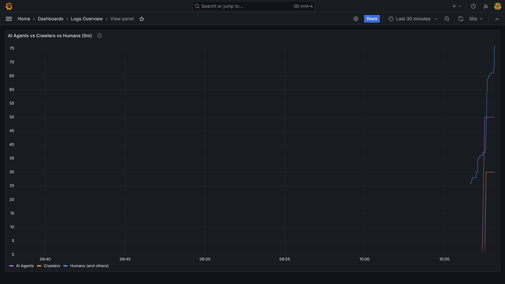

Una cosa che ho già concluso nella [presentazione di questo sito](/it/posts/about-this-site): il web è sempre stato popolato principalmente da bot. Scanner di porte, crawler, feed reader, monitor sintetici. Gli umani sono una minoranza nei log del server, e lo sono sempre stati.

Quello che è cambiato è la qualità dei bot. I vecchi erano indiscriminati: avrebbero volentieri scansionato qualsiasi cosa e l'avrebbero infilata in un indice. La nuova ondata di agenti AI è considerevolmente più esigente. Perplexity, ChatGPT con la navigazione, la ricerca web di Claude, e centinaia di pipeline RAG personalizzate ora recuperano pagine web per costruire contesto utile a rispondere alle domande. E questi agenti, a differenza dei loro antenati, hanno opinioni: preferiscono di gran lunga ricevere markdown pulito o testo semplice piuttosto che scavare attraverso strati di HTML, markup di navigazione e bundle JavaScript.

Mi sono imbattuto nell'[articolo di Dennis Morello sulla configurazione del suo sito per la scopribilità AI](https://morello.dev/blog/configuring-my-site-for-ai-discoverability) e una frase mi ha colpito:

> "Se il tuo sito non è leggibile da quegli agenti, non esisti per loro."

Abbastanza da convincermi a passare un sabato sera su questo (era la Festa della Liberazione, buona Libertà a tutti!). 
Ecco le **7 modifiche che ho apportato, riutilizzabili per qualsiasi sito statico o con server-rendering**.

## Il Punto di Partenza 📊

Il suo articolo mi ha anche indicato [isitagentready.com](https://isitagentready.com), uno strumento che scansiona il tuo sito e assegna un punteggio su quanto è ben configurato per gli agenti AI. L'ho eseguito su aleromano.com.


25 su 100. Livello 1: Presenza Web di Base. Il sito esisteva sul web, il che contava qualcosa, ma non molto di più dal punto di vista di un agente.

Più in dettaglio:

- **Scopribilità: 67** (2/3 controlli) --> credito parziale, soprattutto grazie alla presenza di una sitemap
- **Contenuto: 0** (0/1 controlli) --> nessun formato di contenuto leggibile dalle macchine
- **Controllo Accesso Bot: 50** (1/2 controlli) --> robots.txt esisteva ma mancavano direttive specifiche per l'AI
- **API, Auth, MCP e Scoperta Skill: 0** (0/6 controlli) --> niente

Il sito funziona bene per gli umani. Ma se un agente AI volesse capire di cosa tratta questo blog, dovrebbe analizzare ogni pagina HTML, combattere attraverso navigazione, script e markup di layout, e in qualche modo estrarre il contenuto effettivo. Dispendioso, fragile e spesso impreciso.

Ho deciso di rimediare. Ecco cosa ho fatto.

## `Content-Signal` in robots.txt 🤖

La modifica più semplice prima. Il vocabolario di `robots.txt` si è espanso per coprire le preferenze specifiche dell'AI oltre le tradizionali direttive `User-agent` e `Disallow`.

Ho aggiunto una riga:

```
Content-Signal: search=yes, ai-train=no, ai-input=yes
```

Questo dice ai crawler: indicizzami per la ricerca, non usare i miei contenuti per l'addestramento dei modelli, ma sentiti libero di usarli come contesto quando rispondi alle domande. La distinzione tra `ai-train` e `ai-input` conta. Sono felice che i miei post aiutino qualcuno a ottenere una risposta utile da un chatbot. Preferirei non vederli assorbiti silenziosamente in un dataset di addestramento senza attribuzione.

La specifica si trova su [contentsignals.org](https://contentsignals.org/) ed è ancora in evoluzione, ma scriverla non costa nulla.

## Date Accurate nella Sitemap 📅

La mia sitemap usava la data di build corrente come `lastmod` per ogni pagina. 🤦 Tecnicamente errato: diceva ai crawler che ogni pagina era stata aggiornata oggi, ad ogni build.

Ho aggiornato la sitemap per leggere il `pubDate` dal frontmatter di ogni post e usarlo come `lastmod`. Ora un post del 2022 segnala correttamente che non è cambiato dal 2022. I crawler possono decidere se effettuare un nuovo recupero basandosi su informazioni accurate.

L'integrazione `@astrojs/sitemap` ha un hook `serialize` esattamente per questo.

## Endpoint Markdown 📄

Questa è la modifica più impattante per i consumatori AI.

Ogni post del blog ha ora un URL parallelo che termina in `.md` che serve il sorgente markdown grezzo. `/posts/about-this-site` serve la pagina HTML completa con navigazione, stili e script. `/posts/about-this-site.md` serve solo il contenuto, con `Content-Type: text/markdown`.

Per un agente AI, analizzare il markdown grezzo è enormemente più economico che analizzare l'HTML. Nessun attraversamento del DOM, nessuna indovinatura di selettori, nessun filtraggio di elementi di navigazione e widget del footer. Solo il testo.

Implementare questo in Astro ha significato creare un nuovo file endpoint chiamato `[...slug].md.ts`. L'estensione `.ts` viene rimossa dal router di Astro, lasciando `.md` come suffisso del percorso. Il gestore prende `post.body` dalla content collection e lo restituisce. Una decina di righe di codice.

La parte migliore: questo mi viene gratis. Scrivo già ogni post in markdown. L'endpoint espone semplicemente quello che è già lì, senza conversioni, senza preprocessing, senza strumenti aggiuntivi.

Anche le traduzioni italiane ottengono i loro endpoint `.md`, a `/posts/it/slug.md`.

## Pubblicizzare gli URL Markdown 🔗

Avere gli endpoint è metà del lavoro. L'altra metà è assicurarsi che gli agenti possano trovarli facilmente.

Ho aggiunto due livelli di "pubblicità".

**Nell'`<head>` HTML:**

```html
<link rel="alternate" type="text/markdown" href="/posts/about-this-site.md" />
```

Qualsiasi agente che recupera l'HTML e legge l'head trova immediatamente l'alternativa markdown.

**Negli header HTTP della risposta:**

```
Link: </posts/about-this-site.md>; rel="alternate"; type="text/markdown"
```

Questo è più potente: le informazioni sono disponibili prima che il corpo HTML venga anche analizzato. Secondo [RFC 8288](https://www.rfc-editor.org/rfc/rfc8288), gli header di risposta `Link` sono il meccanismo giusto per pubblicizzare le relazioni tra risorse a livello HTTP.

Ho esteso il middleware Astro esistente (già usato per l'auth /admin) per aggiungere header `Link` a ogni risposta. Le pagine dei post del blog ottengono il link markdown specifico del post. Tutte le pagine ottengono link globali che puntano al feed RSS, alla sitemap e ai file indice LLM.


## llms.txt e llms-full.txt 📚

Una [convenzione in sviluppo](https://llmstxt.org/) nel web AI-friendly è pubblicare un file `llms.txt` alla radice del sito. Pensalo come un robots.txt per i consumatori AI: un indice in testo semplice che fornisce agli agenti una mappa del tuo contenuto senza fargli scansionare ogni pagina individualmente.

Ho implementato due varianti:

**`/llms.txt`** è un indice strutturato che elenca ogni post inglese con il suo titolo, descrizione e un link diretto all'endpoint `.md`:

```
# Alessandro Romano

> I pensieri di Alessandro Romano.

## Post del Blog

- [Rendere il Mio Sito Pronto per gli Agenti AI](/posts/agent-ready.md): Come sono passato...
- [Il Mio Amico ha Fatto un Test di Carico sul Mio Sito](/posts/friend-stress-tested-my-website.md): Una storia su...
```

**`/llms-full.txt`** è il corpus completo: ogni post in markdown concatenato in un unico file, separato da divisori con un'intestazione per post. Utile per gli agenti che vogliono contesto completo senza fare decine di richieste individuali.

Le traduzioni italiane sono intenzionalmente escluse da entrambi i file. Sono traduzioni di contenuti inglesi esistenti e sarebbero solo materiale duplicato nei corpora AI.

## Indice di Scoperta Skill per Agenti 🗂️

Una convenzione più recente e ancora in evoluzione: un file leggibile dalle macchine su `/.well-known/agent-skills/index.json` che elenca le capacità rilevanti per l'AI che espone il tuo sito. La specifica è una bozza RFC di Cloudflare ([agentskills.io](https://agentskills.io)).

Il mio elenca quattro voci: l'indice LLM, il corpus completo, il feed RSS e la sitemap. È un singolo file JSON statico con un costo di manutenzione sostanzialmente zero.

La specifica è ancora nei suoi early days, ma costava talmente poco implementarla che l'ho fatta.

## Dati Strutturati (JSON-LD) 🏷️

Ogni post del blog include ora un blocco JSON-LD `BlogPosting` nell'`<head>`. Questo fornisce agli agenti metadati strutturati e tipizzati: numero di parole, tempo di lettura, data di pubblicazione, il corpo dell'articolo come testo semplice, identità dell'autore con le sue aree di competenza, e un percorso breadcrumb.

L'infrastruttura era già presente nel componente `SEO`: accettava una prop `structuredData` e la rendeva come tag script. Dovevo solo costruire l'oggetto giusto in `BlogPostLayout` e passarlo. La lista `author.knowsAbout` riutilizza gli stessi valori dello schema `Person` sulla pagina about, mantenendo la coerenza.

## Cosa Ho Deliberatamente Saltato ❌

L'audit ha anche segnalato diverse cose che ho scelto di non implementare.

**API Catalog (RFC 9727):** Il sito non ha API pubbliche. I percorsi `/api/` sono tutti interni (analytics, form di contatto, rate limiting). Pubblicare un catalogo API per endpoint interni sarebbe fuorviante.

**OAuth e metadati delle risorse protette:** L'accesso admin usa HTTP Basic Auth. Nessun OAuth da nessuna parte. Non applicabile.

**MCP Server Card:** La specifica è ancora una PR bozza aperta. Il sito non espone un server MCP, quindi non c'è nulla da pubblicizzare. Prematuro.

**WebMCP (`navigator.modelContext`):** WebMCP permette a una pagina di esporre strumenti e azioni a un modello AI sulla pagina. Un blog non ha azioni significative da esporre: non c'è nulla che un agente debba fare qui oltre a leggere. La scoperta del contenuto è già gestita da llms.txt, quindi WebMCP non aggiungerebbe nulla.

**Negoziazione del contenuto `Accept: text/markdown`:** Alcune implementazioni servono markdown quando una richiesta include questo header. L'approccio con URL `.md` statici copre lo stesso caso d'uso senza la complessità della negoziazione del contenuto ed è molto più facile da memorizzare nella cache.

## È il Futuro Che Vorrei? 🤔

Il web si è sempre adattato a come i contenuti vengono consumati. Abbiamo aggiunto RSS per i feed reader. Abbiamo aggiunto i tag Open Graph per le anteprime social. Abbiamo aggiunto i dati strutturati per i frammenti dei risultati di ricerca. Gli agenti AI sono il prossimo livello di consumatore, e l'investimento per supportarli è genuinamente piccolo: pochi file endpoint, un paio di header di risposta, due file di testo e un blob JSON.

Il punteggio iniziale era 25. Aggiornerò questo post con il punteggio finale una volta che le modifiche saranno live sul sito di produzione.

## Bonus: Dividere il traffico in Grafana 📈

Come complemento a queste modifiche, ho aggiunto un pannello al dashboard dei log Grafana del sito che divide il traffico nginx in tre serie per user agent: agenti AI noti (GPTBot, ClaudeBot, PerplexityBot e consumatori simili basati su LLM), crawler noti (Googlebot, Bingbot, bot di anteprima social), e tutto il resto.



Questo screenshot proviene da un test locale in cui ho inviato 50 richieste di agenti AI falsi e 20 richieste umane false per verificare il pannello. La linea "humans" è più alta perché raccoglie anche il traffico del browser dal caricamento di Grafana stesso. Sul sito di produzione reale il rapporto sarà più indicativo.

Una regex Loki sugli user agent non è un rilevamento perfetto: gli agenti che non si identificano finiscono nel bucket degli umani, e alcuni fingono deliberatamente di essere browser. Ma quelli che si annunciano danno abbastanza segnale da valere la pena di monitorare.
