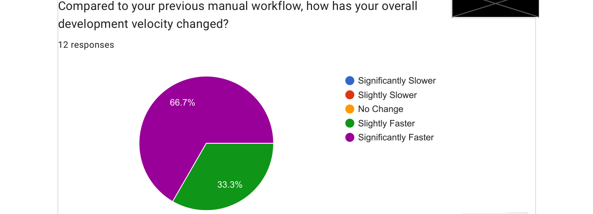
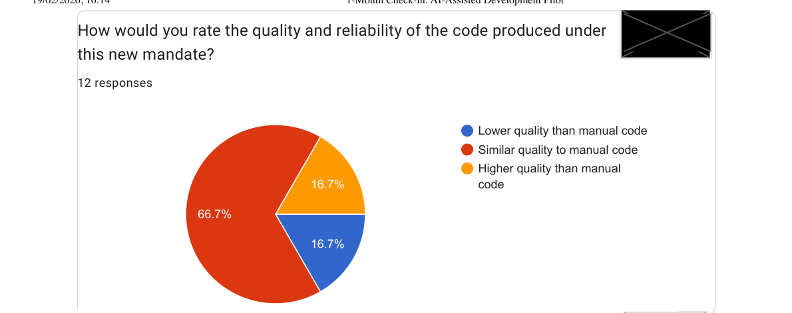
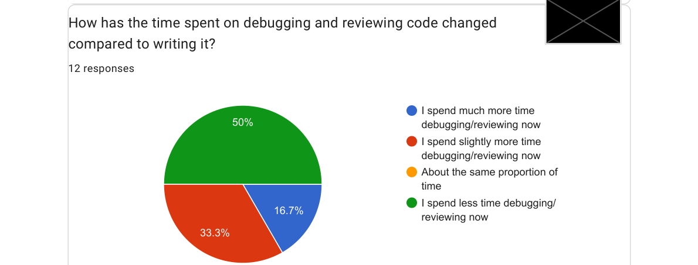
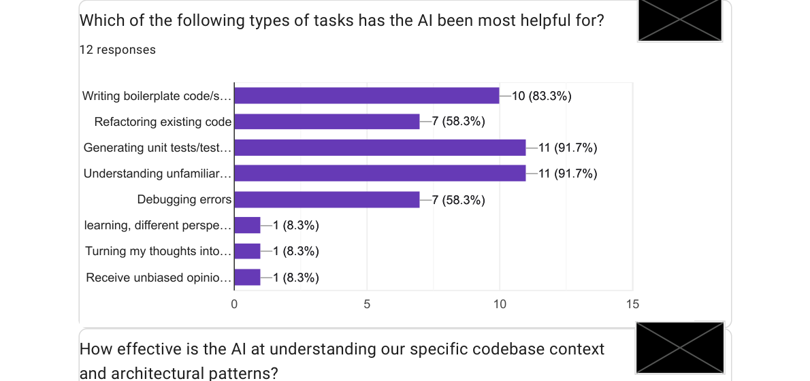
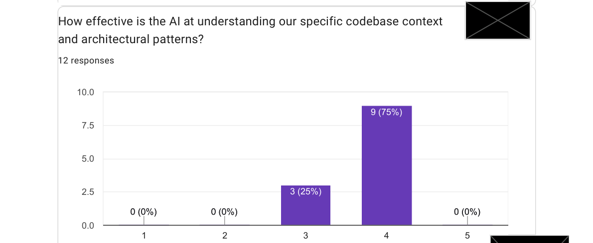
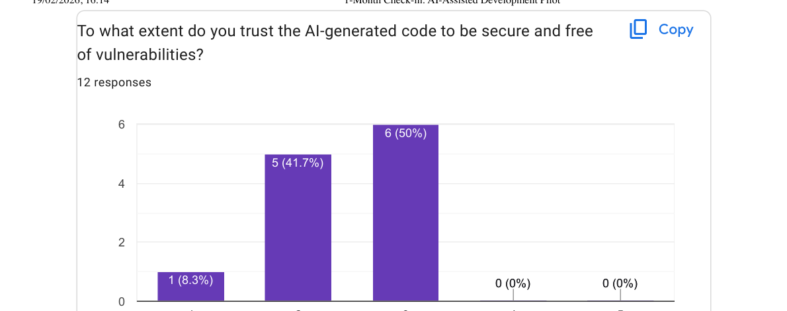
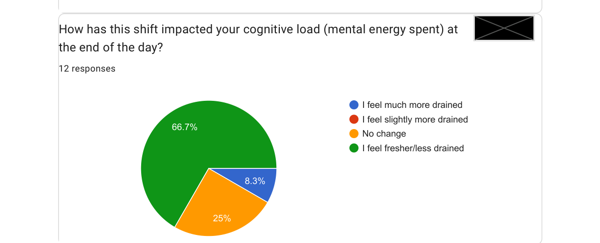
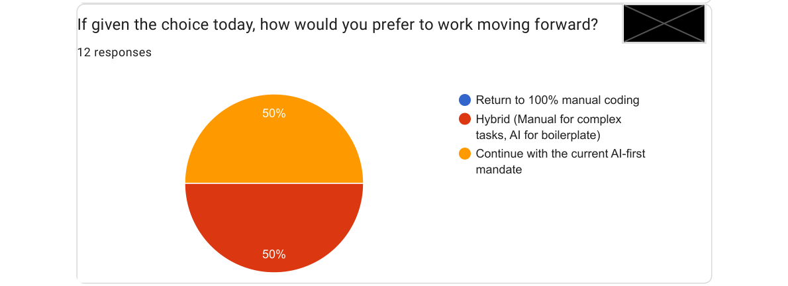

> DISCLAIMER: Non vedo i miei ingegneri come nell'immagine qui sopra. Ma mi piaceva come mi ha ritratto Nano Banana, quindi ho deciso di tenerla lo stesso 😁

"Dovete provarci. No, sul serio. A partire dalla prossima settimana, dovete usare di default lo sviluppo assistito dall'AI. Punto."

L'ho detto a inizio gennaio 2026, davanti ai miei tre team di ingegneri software. Su LinkedIn mi sono descritto, scherzando, come uno che ha "fatto il manager autoritario". Ma non è che scherzassi troppo 😁

Ho scritto di come [lo sviluppo assistito dall'AI abbia cambiato le mie abitudini da sviluppatore](/posts/it/manage-parent-code-ai), e di come [l'AI sia diventata un ponte tra idee ed esecuzione](/posts/it/high-agency-ai-philosophy). Ma c'è una differenza tra un Engineering Manager che scrive codice il sabato sera e chi chiede al proprio team di cambiare il modo in cui lavora ogni giorno. Una è un esperimento personale. L'altra è una decisione manageriale che riguarda persone reali, il loro mestiere e il loro senso di autonomia.

Quindi ho messo un numero: **un mese**. Avremmo fatto un esperimento forzato, poi avrei chiesto feedback e lasciato parlare i dati.

Ecco cosa ho scoperto.

## 🤔 Perché un Obbligo e Non una Raccomandazione?

So già cosa potete pensare: gli obblighi sono autoritari e gli ingegneri sono professionisti: dovrebbero scegliere i propri strumenti.

In linea di principio sono d'accordo, ma ho visto l'"adozione facoltativa" troppo rischiosa per il treno dello sviluppo assistito dall'AI. 

Temevo che se non avessi agito, sei mesi dopo, mi sarei trovato una cultura divisa, pratiche incoerenti e nessun apprendimento condiviso.

> L'unico modo per avere un'opinione genuina del team su qualcosa è che tutto il team lo sperimenti davvero.

Non chiedevo loro di adottarlo in modo permanente. Chiedevo di provarci in modo serio e mi ero impegnato ad ascoltare i risultati. Mi sembrava ragionevole.

Dodici ingegneri hanno completato il sondaggio dopo un mese. Ecco cosa hanno detto.

## 🚀 Velocità: Tutti Più Veloci

**Il 100% del team ha percepito di aver lavorato più velocemente.** Nessuno ha riportato lo stesso ritmo. Nessuno ha rallentato.

Non mi aspettavo l'unanimità. Mi aspettavo una distribuzione sana, magari qualche scettico che sentiva che il carico di revisione annullasse la velocità di generazione. Invece: tutti, senza eccezioni, si sono sentiti più veloci.

Di nuovo: non ho dati oggettivi che provano questa affermazione, ma per il mio scopo mi bastava avere un impatto sulla *percezione* delle persone.

## 🤨 Qualità del Codice: Tiene, con Sfumature

Il risultato sulla velocità sarebbe inutile se la qualità fosse crollata. Ecco cosa ha riportato il team:

Due terzi non vedono regressioni di qualità. Un sesto riporta addirittura miglioramenti. Un sesto riporta qualità inferiore, il che mi dice che lo strumento non è uniformemente efficace in tutti i contesti, o che alcuni membri del team non hanno ancora trovato l'approccio al prompting che funziona per loro.

Questo si collega a qualcosa che ho detto nel mio post sul [context engineering](/posts/it/manage-parent-code-ai): la qualità dell'output dipende molto da come viene fornito il contesto. Una delle risposte aperte del sondaggio lo ha detto direttamente:

> "I risultati dipendono molto dall'approccio al prompting — dovremmo condividere le best practice come team."

È un feedback che sto prendendo sul serio. Strumenti condivisi senza tecnica condivisa sono solo metà del lavoro.

## ⏱️ L'Equilibrio Debug/Scrittura È Cambiato

Ecco il risultato che ha generato la conversazione più interessante con il mio team:

Metà del team dedica più tempo a revisionare l'output dell'AI di quanto ne dedicasse a scrivere codice manualmente. È un vero cambio nella natura del lavoro. E onestamente? Credo sia per lo più sano.

Una delle risposte del sondaggio l'ha detto in un modo che mi è rimasto:

> "Revisionare il codice generato dall'AI usata da un junior è una grande opportunità di apprendimento. Il codice è 'okay' ma manca di *gusto*."

Quella frase, *manca di gusto*, è esattamente giusta. L'AI genera codice strutturalmente corretto che spesso manca del giudizio sottile e accumulato che viene da anni di sviluppo software in un dominio specifico con un team specifico. Il codice funziona. Semplicemente non sempre *appartiene*.

Il che significa che abbiamo un altro metodo per trasmettere alle persone meno esperte di maturare il proprio giudizio, attraverso i commenti sulle code reviews.

## 🛠️ Dove l'AI Ha Davvero Aiutato

Ho chiesto al team quali attività ha trovato più utili per l'AI. Potevano selezionare più opzioni:

Due task in cima a pari merito: **generare unit test** e **comprendere codice non familiare**, entrambi a quasi il 92%.

Il risultato sugli unit test non mi sorprende. È qui che l'AI brilla costantemente perché i test sono ben delimitati, hanno criteri di successo chiari e liberano il tempo degli sviluppatori per le decisioni più difficili. L'ho [scritto anche prima](/posts/it/manage-parent-code-ai): chiedere all'AI di scrivere i test e poi validarli è uno dei migliori utilizzi dello strumento.

Il risultato sulla "comprensione del codice non familiare" è quello che mi entusiasma di più. Lavoriamo su un monorepo Java con anni di contesto accumulato. I nuovi arrivati ora usando l'AI come navigatore della codebase. Un assistente paziente e sempre disponibile. Un partecipante ha notato:

> "Ha fatto controlli di coerenza su 4 repository e ha rifattorizzato del codice in modo ottimale."

Detto questo, un altro partecipante ha aggiunto una nota a margine:

> "Ha completamente mancato lo scopo dei test che ha creato — ho dovuto tornare alla modalità 'manuale'."

Capita. L'AI ha [bisogno di poter allucinare](https://openai.com/index/why-language-models-hallucinate/) per rimanere uno strumento così efficace.

## 🔍 Quanto Capisce Davvero il Nostro Codebase?

Ho chiesto al team di valutare l'efficacia dell'AI nel comprendere il nostro codebase specifico su una scala da 1 a 5.

Nessuno l'ha valutata sotto il 4. È un segnale significativo, specialmente per un codebase aziendale complesso. Un partecipante ha menzionato che Opus funziona bene ma è costoso in termini di token, e che l'integrazione con IntelliJ ha ancora degli spigoli. La maturità degli strumenti sta ancora rincorrendo la capacità dei modelli.

Il suggerimento emerso: investire tempo nel tuning di **AGENTS.md, copilot-instructions.md e CLAUDE.md**.

## 🔐 Fiducia sulla Sicurezza: Un Gap Chiaro

Ho chiesto al team quanto si fida del codice generato dall'AI dal punto di vista della sicurezza, su una scala da 1 a 5.

Nessuno ha dato più di 3. La media è intorno a 2.4/5. Nessuno nel team si sente abbastanza sicuro da rilasciare codice generato dall'AI senza una revisione attenta sulla sicurezza, e credo sia il giusto modo di porsi. I modelli AI non hanno threat model. Non pensano al tuo ambiente di deployment, ai tuoi user patterns o alla sensibilità dei tuoi dati. Producono codice che *funziona*, non necessariamente codice che è *sicuro*.

## 😌 Il Risultato Che Mi Sta più a Cuore

Eccone uno su cui continuo a tornare. Ho chiesto: come ti senti a fine giornata rispetto a prima?

Due terzi del mio team finisce la giornata meno stanco di prima.

Sono manager da abbastanza tempo da sapere che **l'affaticamento degli sviluppatori è un costo reale**, uno che non appare nella velocità degli sprint o nel throughput dei ticket. Appare nella qualità delle decisioni. Nella disponibilità ad affrontare un problema difficile di venerdì. Nelle conversazioni di retention sei mesi dopo.

L'idea che un cambiamento di strumenti possa ridurre il carico cognitivo, che la tecnologia possa effettivamente rendere la giornata lavorativa più leggera, è quello che trovo più entusiasmante di questo esperimento. Si allinea con qualcosa in cui credo genuinamente:

> La tecnologia dovrebbe servire il benessere umano, non solo le metriche di produttività.

La velocità è importante. Gli ingegneri meno esausti a fine giornata lo sono di più.

## 🔮 Cosa Vuole il Team Adesso

Ho chiesto: adesso che hai provato, come preferiresti lavorare in futuro?

Zero persone vogliono tornare indietro. Forse questo è il segnale più chiaro di tutti.

La divisione tra "AI-first" e "ibrido" è sana. Riflette casi d'uso diversi e diversi livelli di comfort. Il mio piano non è imporre un unico flusso di lavoro, ma **rendere concreto l'approccio ibrido**: linee guida chiare su quando affidarsi molto all'AI, quando scrivere manualmente e come revisionare l'output dell'AI con il giusto livello di scrutinio.

Un partecipante ha chiesto specificamente **demo concrete del flusso di lavoro AI con i nostri strumenti reali**: il monorepo Java, il nostro setup IDE. Va nell'agenda del team. La tecnica condivisa è il prerequisito degli strumenti condivisi.

## 💡 Cosa Mi Porto A Casa

Dodici ingegneri. Un mese. Alcune cose in cui ora credo più fermamente:

**I guadagni di produttività sono reali.** Il 100% di percezione di miglioramento della velocità non è un errore di arrotondamento. Sta succedendo qualcosa di significativo.

**La riduzione dell'affaticamento è la storia sottovalutata.** La velocità è misurabile. Il benessere è più difficile da quantificare, ma il segnale qui è forte. Voglio monitorarlo nel tempo.

**Il gap sulla sicurezza ha bisogno di una risposta strutturata.** Agenti specifici che si occupano di rivedere questo aspetto?

## Conclusione 🔁

Ho imposto l'AI. Ho ascoltato il feedback. Mi ha sorpreso quello che è emerso.

Non si trattava di forzare uno strumento su ingegneri che non lo volevano. Si trattava di dare a tutti la stessa esperienza reale prima di formarsi un'opinione, e poi costruire una pratica condivisa da quello che abbiamo imparato insieme.

L'esperimento ha funzionato. Non tanto per i numeri che escono dal sondaggio, ma perché ora abbiamo un team con vocabolario condiviso, dati condivisi e prossimi passi condivisi. È quello che dovrebbe produrre una decisione manageriale.

Se sei un Engineering Manager ancora indeciso: lo strumento è maturo. La vera domanda è se sei pronto a guidare l'adozione con la stessa cura che daresti a qualsiasi altra pratica del team.
