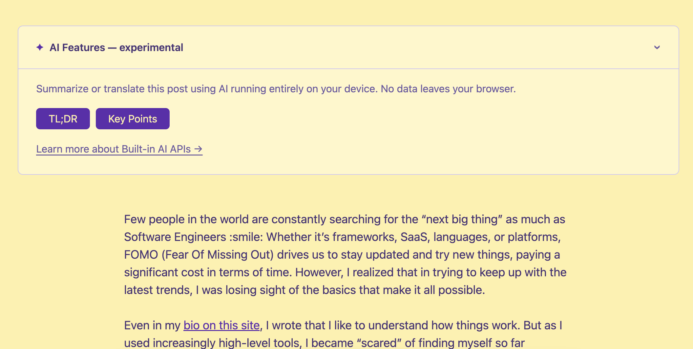
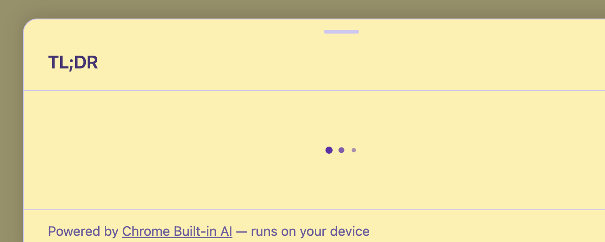
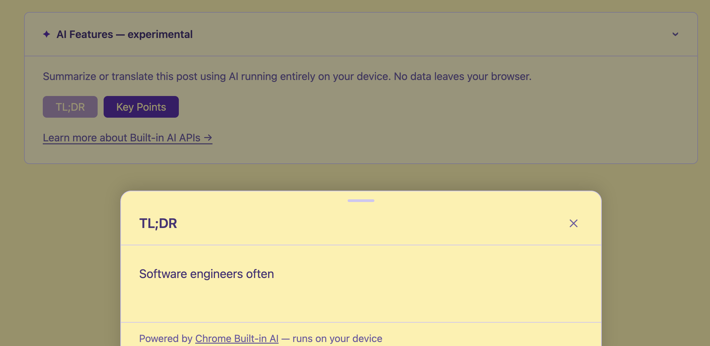
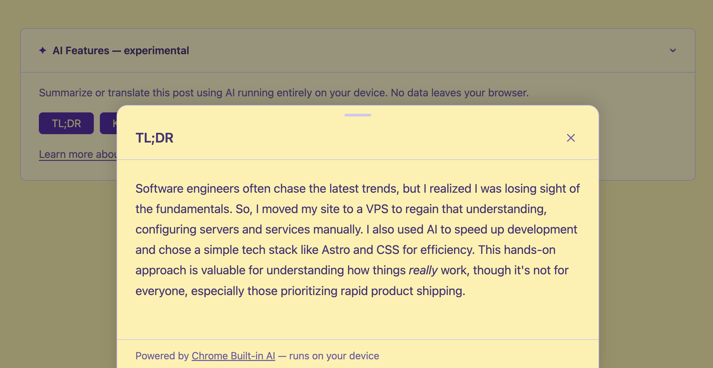
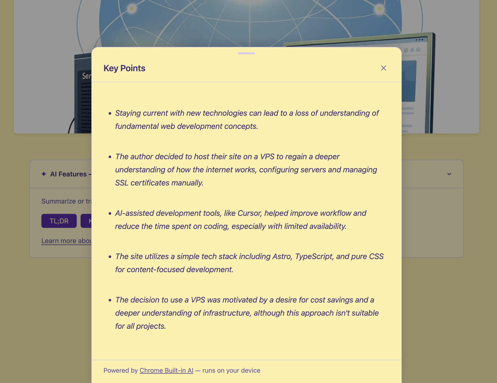

Se stai leggendo questo su Chrome con le impostazioni giuste, potresti aver notato il banner "✦ Funzionalità AI — sperimentale" in cima a questo articolo. Cliccalo e troverai i pulsanti per ottenere un *TL;DR*, estrarre i *punti chiave*, o *tradurre* il post nella tua lingua — tutto senza che un singolo byte lasci il tuo browser.



Nessuna API key né costi. Nessun round-trip verso un server. Nessun compromesso sulla privacy.

Queste sono le **Built-in AI APIs** di Chrome: piccoli modelli on-device distribuiti insieme al browser ed esposti tramite una API JavaScript nativa. Ho passato una sera ad integrarle in questo blog dopo essere stato ispirato da [questo talk](https://www.webdayconf.it/e/sessione/5092/AI-nel-browser-costruire-feature-con-le-Built-in-AI-API) al WebDay di [Valerio Como](https://www.linkedin.com/in/valeriocomo/).

Questo articolo racconta cosa ho imparato.

## Cosa Sono le Built-in AI APIs di Chrome?

Chrome 138+ include **Gemini Nano** — un modello linguistico piccolo ed efficiente che gira localmente sulla tua macchina. Google lo espone tramite un insieme di API JavaScript:

- **Summarizer API** — riassume il testo come TL;DR, punti chiave, teaser o headline
- **Translator API** — traduce tra coppie di lingue usando modelli locali
- **Language Model API** (Prompt API) — generazione di testo general-purpose
- **Writer / Rewriter APIs** — stesura e rielaborazione di testo

Tutte sono sperimentali. Sono dietro flag in Chrome, richiedono il download di un componente modello e la superficie dell'API è ancora in evoluzione. Ma esistono, funzionano e sono utili già così.

## Feature Detection: Il Modo Giusto

La prima cosa che ho sbagliato è stata la detection. Avevo assunto che le API si trovassero su `window.ai`, come suggerivano le prime bozze della spec. Non è così — almeno non in Chrome 138+. I global effettivi sono:

```javascript
'Summarizer' in self   // true se la Summarizer API è disponibile
'Translator' in self   // true se la Translator API è disponibile
'LanguageModel' in self // true se la Prompt API è disponibile
```

Ogni API ha anche un metodo `availability()` che indica se il modello è pronto:

```javascript
const status = await Summarizer.availability({ outputLanguage: 'it' });
// → 'available' | 'downloadable' | 'downloading' | 'unavailable'
```

- **`available`** — modello pronto, si può usare subito
- **`downloadable`** — il dispositivo è compatibile, modello non ancora scaricato; chiamare `create()` avvierà il download
- **`downloading`** — download in corso
- **`unavailable`** — il dispositivo non soddisfa i requisiti o la funzione è disabilitata

Un dettaglio importante: bisogna passare `outputLanguage` anche ad `availability()`, non solo a `create()`. Chrome mostrerà un avviso in console se non lo si fa.

## Riassunto

La Summarizer API riceve il testo e restituisce un riassunto come `ReadableStream`. Si crea un summarizer con un tipo e un formato specifici:

```javascript
const summarizer = await Summarizer.create({
  type: 'tldr',          // 'tldr' | 'key-points' | 'teaser' | 'headline'
  format: 'plain-text',  // 'plain-text' | 'markdown'
  length: 'medium',
  outputLanguage: 'it',
});

const stream = summarizer.summarizeStreaming(text);
```



Una cosa che mi ha sorpreso: il valore di `type` è **`'tldr'`** (senza punto e virgola né trattino). La documentazione iniziale usava `'tl;dr'`, ma quello lancia un TypeError in Chrome 146. L'enum è cambiato. Meglio controllare sempre la [documentazione aggiornata della Summarizer API](https://developer.chrome.com/docs/ai/summarizer-api).

Per i punti chiave uso `format: 'markdown'` perché l'output è una lista puntata — renderizzarla come testo semplice ne perde la struttura. Per il TL;DR, il testo semplice va bene.

## Traduzione

La Translator API funziona in modo simile. Si verifica la disponibilità per una coppia di lingue specifica, si crea un translator e si fa lo streaming del risultato:

```javascript
const isTranslationModelAvailable = await Translator.availability({
  sourceLanguage: 'it',
  targetLanguage: 'fr',
});

if (isTranslationModelAvailable) {
  const translator = await Translator.create({
    sourceLanguage: 'it',
    targetLanguage: 'fr',
  });
  const stream = translator.translateStreaming(text);
}
```

Il Translator lavora a livello di frase. Ogni chunk che emette è una frase tradotta — un **delta**, non il testo completo aggiornato. Questo è importante per come si renderizza lo stream.

## Streaming: Replace vs. Append

Qui ho perso un po' di tempo. Le due API hanno semantiche di streaming diverse — almeno quando ho iniziato a costruire questa feature:

- Il **Summarizer** emetteva in origine il *testo completo accumulato* ad ogni chunk (modalità replace)
- Il **Translator** emette *delta di frasi* (modalità append)



Ma testando con Chrome 146, anche il Summarizer è passato ad emettere delta. Quindi ho finito per usare la **modalità append** per entrambi: accumulo ogni chunk e ri-renderizzo:

```javascript
let accumulated = '';
for await (const chunk of stream) {
  accumulated += chunk;
  renderMarkdown(accumulated);
}
```



Se vedi solo l'ultima frase nell'output, probabilmente stai sostituendo quando dovresti accumulare.

## L'UI: Bottom Sheet + Callout

Ho costruito due componenti:

**`BuiltInAICallout.astro`** — un elemento `<details>` collassabile in cima ad ogni articolo. Rileva le funzionalità disponibili al caricamento della pagina e mostra solo i pulsanti rilevanti. Se non è disponibile nulla (Firefox, Safari, Chrome vecchio), si nasconde completamente — nessuna traccia nell'UI.

**`BuiltInAIBottomSheet.astro`** — un pannello che si solleva dal basso e mostra l'output AI in streaming. Usa `marked` per renderizzare il markdown, scrolla automaticamente man mano che il contenuto arriva, e si chiude con Escape, clic sul backdrop o il pulsante X.

Un bug CSS sottile che ho trovato: l'animazione di caricamento usava `display: flex`, che sovrascrive l'attributo HTML `[hidden]`. La soluzione:

```css
.loading[hidden] { display: none; }
```



## Privacy

Questa è la parte che trovo più convincente. L'intera funzionalità funziona offline dopo che il modello è scaricato. Nessuna richiesta lascia il browser. Nessun testo viene inviato a nessun server.

Il lato negativo: funziona solo su Chrome e richiede che l'utente abbia scaricato il modello Gemini Nano. Le API restituiscono `'unavailable'` su Firefox, Safari e qualsiasi Chrome più vecchio. Il mio callout gestisce questo in modo elegante — si nasconde completamente quando niente è disponibile.

## Cosa Ho Imparato

**La superficie dell'API è ancora in movimento.** Il cambio da `'tl;dr'` a `'tldr'` mi ha colto di sorpresa. Il comportamento dello streaming è cambiato tra versioni di Chrome. Trattale come genuinamente sperimentali.

**La feature detection deve essere granulare.** Non dare per scontato che `Summarizer` e `Translator` siano sempre entrambi disponibili. Un utente potrebbe avere un modello scaricato ma non l'altro. Progetta l'UI per gestire ogni combinazione.

**L'AI on-device è più lenta dell'AI cloud.** Gemini Nano non è un LLM "normale". È un modello piccolo ottimizzato per l'inferenza su dispositivo. I riassunti sono buoni, le traduzioni sono decenti, ma non aspettarti la stessa qualità di un modello frontier. Per l'uso qui — un ausilio opzionale al lettore — è più che sufficiente.

**La storia della privacy è genuinamente solida.** Per chiunque stia costruendo funzionalità dove la sensibilità dei dati è importante, l'inferenza on-device è ora un'opzione reale, non un progetto di ricerca.

L'intera implementazione è open source — puoi sfogliare i componenti e il modulo utility su [GitHub](https://github.com/aleromano92/aleromano.com).
