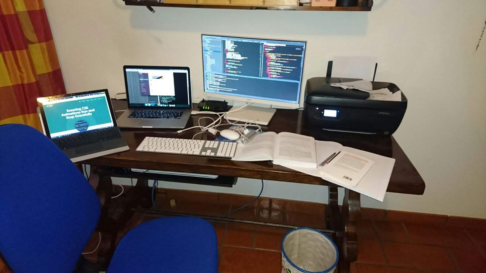
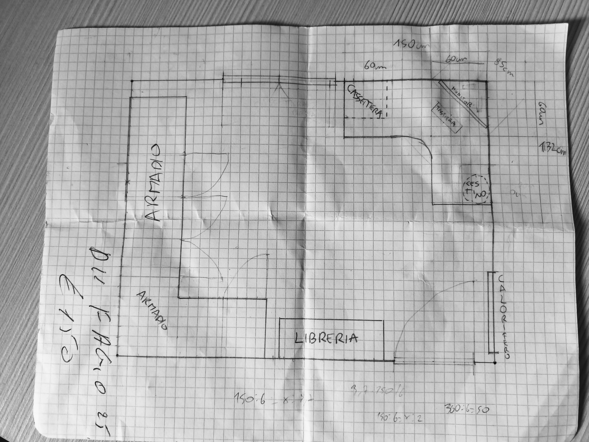
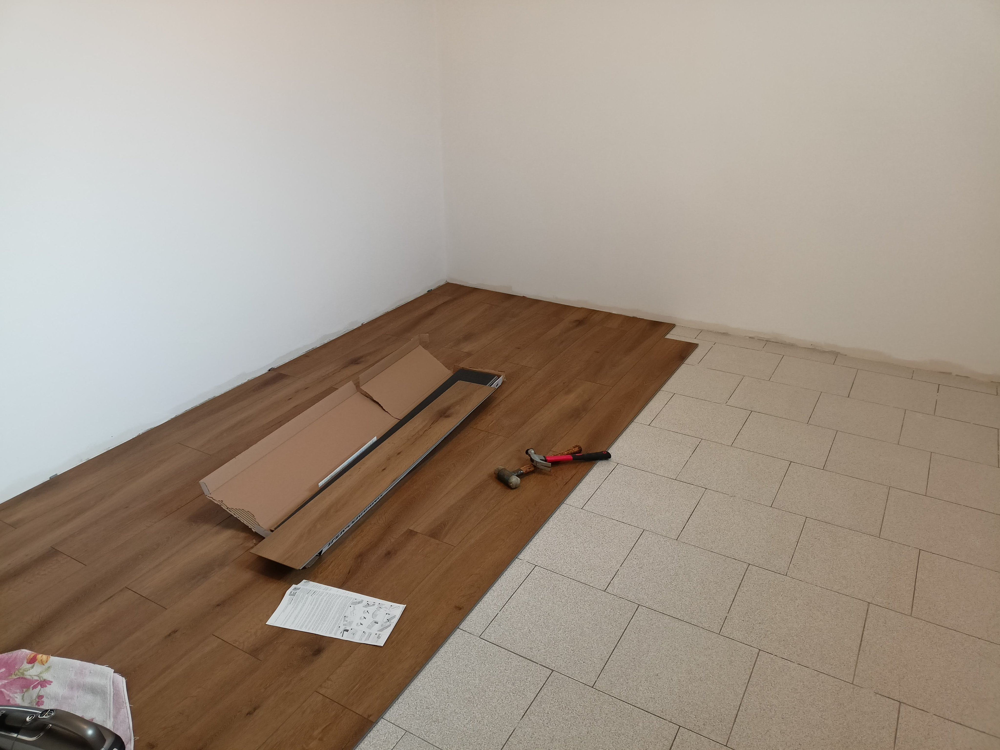
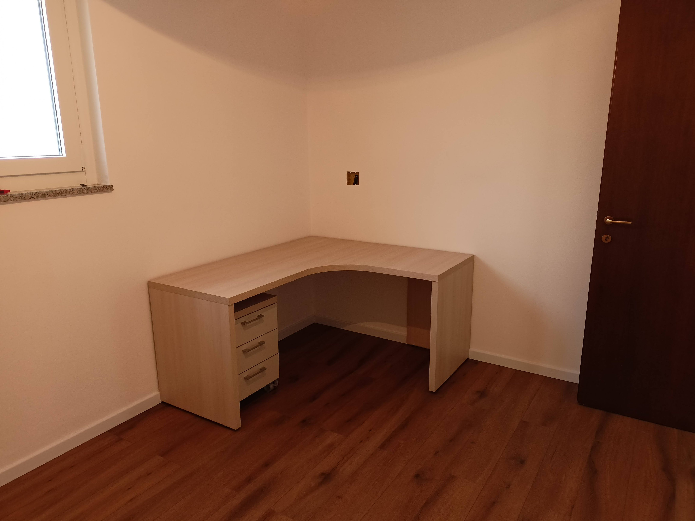
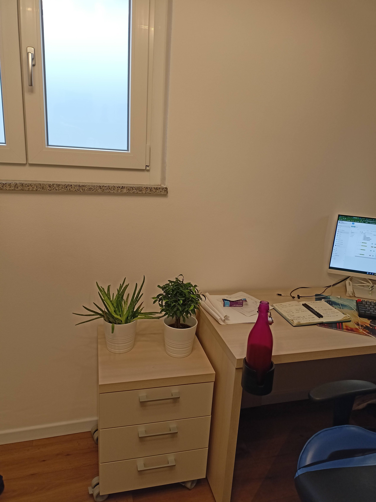
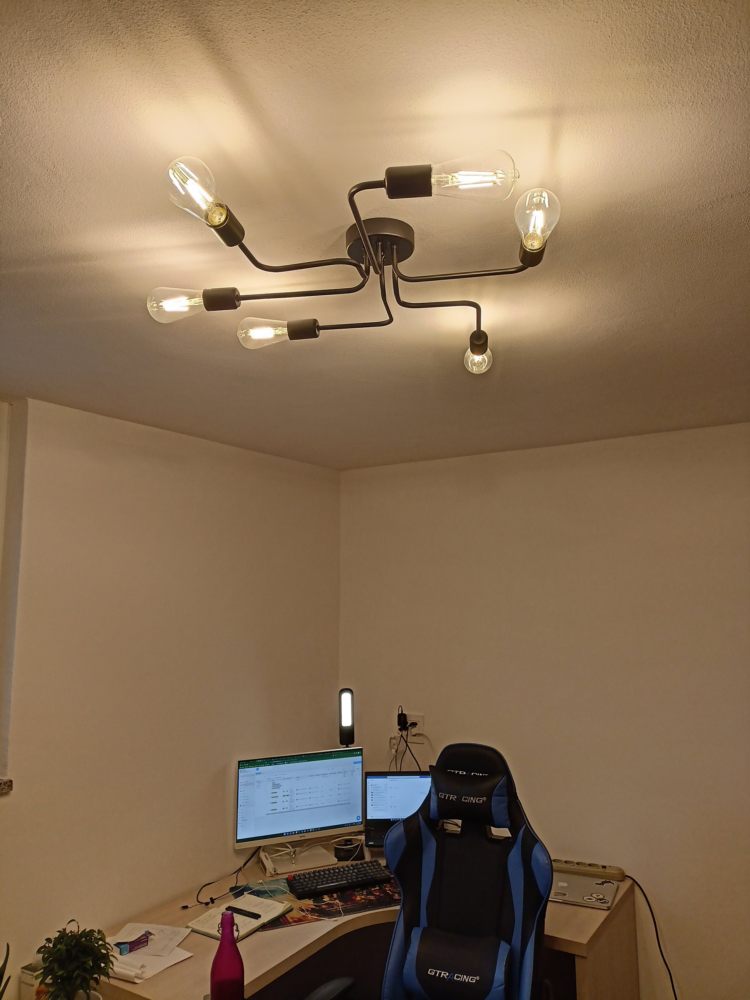
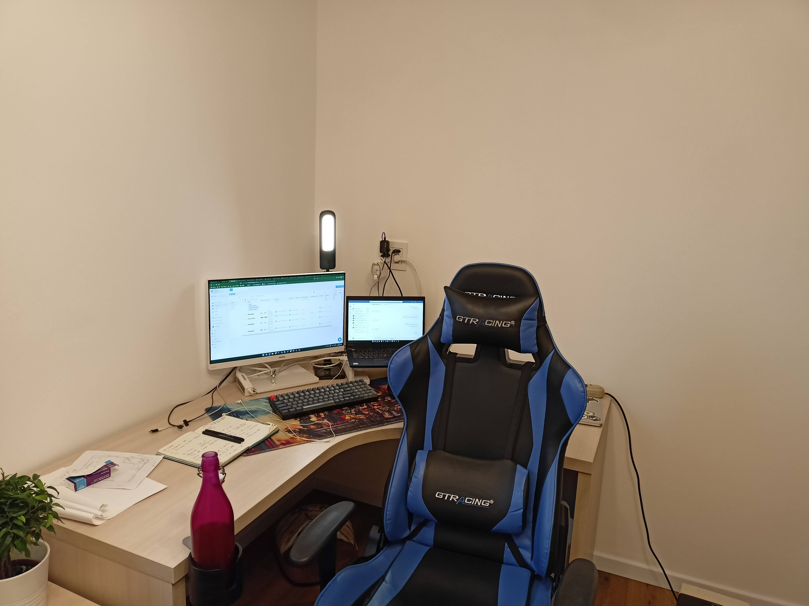
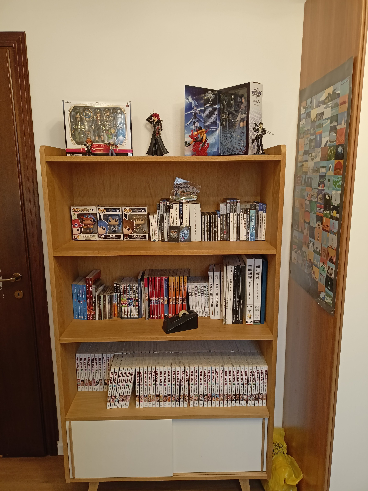

> Disclaimer: in questo post troverai link di affiliazione Amazon. Se acquisti da questi link, mi offrirai una birra, più o meno, senza costi aggiuntivi per te 👍

Ho deciso di rinnovare il mio Home Office.

I 4 aspetti su cui mi sono concentrato:

1. aumentare il comfort 💺
2. migliorare l'esperienza sonora 🔊
3. apparire meglio durante le videochiamate 💅🏻
4. ridurre le distrazioni ❗

## Questo era il punto di partenza

Una scrivania orizzontale 160x60cm, un monitor esterno, tastiera e mouse. In questa foto, si può vedere il mio vecchio Surface 3 (l'ho venduto) e i miei libri e quaderni mentre studiavo per la laurea.

## I contro

- La sedia non aveva il supporto lombare.
- Non potevo appoggiare le braccia sulla scrivania mentre digitavo, perché la scrivania non era abbastanza grande: la tastiera era troppo vicina al bordo della scrivania.
- La tastiera era una vecchia (ma buona) tastiera Apple con un Mighty Mouse.
- 🔊 Non avevo né altoparlanti esterni né microfono, quindi passavo la giornata sempre con gli auricolari (un paio Sony che amo davvero [**amzn.to/3pH7TwQ**](https://amzn.to/3pH7TwQ)).
- 💅🏻 Avevo molte ombre e luce che provenivano da sinistra, facendomi apparire male sulla webcam.
- ❗La stanza era condivisa con mia moglie: la sua scrivania era sul lato opposto della stanza. Ma avevamo problemi quando entrambi partecipavamo alle riunioni. Inoltre, usavamo quella stanza come armadio quindi era un po' disordinata.

## Inizio della ristrutturazione

Abbiamo una casa molto spaziosa (fortunati noi) quindi ho potuto utilizzare parte del nostro seminterrato per creare un Home Office privato. La stanza è 3,80 x 2,80 mt e ho iniziato a fare uno schizzo di una possibile disposizione dei mobili.

La parte più importante su cui mi sono concentrato era la scrivania. Volevo una grande scrivania ad angolo con molto spazio per appoggiare le braccia (45cm dal bordo della scrivania alla tastiera) e la giusta distanza dai monitor (60-70cm pronti per migrare a uno grande curvo).

Volevo una libreria dove poter mostrare le mie collezioni di Final Fantasy, Kingdom Hearts e One Piece: manga, videogiochi e action figure così da poter disattivare qualsiasi filtro dello sfondo durante le videochiamate e permettere a chiunque di dare un'occhiata alle mie passioni. 🏯

Volevo creare un'atmosfera dove i colori bianco, legno e verde potessero mescolarsi per darmi un ambiente rilassato e luminoso.

Quindi ho comprato delle piastrelle SPC da installare facilmente sopra quello esistente: il loro meccanismo a click ha permesso a me e mia moglie di farlo da soli.

Ho cercato su diversi siti di seconda mano e ho trovato la mia scrivania, armadio e libreria! È stato molto divertente noleggiare un furgone con mia moglie e andare a prenderli tutti 🚚

## Nuovi acquisti

Prima di tutto, ho comprato una sedia da gaming. Dopo innumerevoli recensioni e giri nei negozi, ho trovato la migliore per le mie esigenze in una sedia GT Player: [**amzn.to/34mU53m**](https://amzn.to/34mU53m)

Poi, volevo una tastiera meccanica portatile con tastierino numerico. Ho sempre seguito Keychron e alla fine ho comprato una K4: [**amzn.to/3sWJVQB**](https://amzn.to/3sWJVQB)

Volevo anche un nuovo mouse, uno ergonomico wireless come l'Anker che ho comprato: [**amzn.to/3vL5nK6**](https://amzn.to/3vL5nK6)

Ho comprato un tappeto trasparente da mettere sotto la sedia per proteggere il nuovo pavimento dalle rotelle della sedia: [**amzn.to/3tCu0pC**](https://amzn.to/3tCu0pC)

Ho già una lampada da scrivania che uso per illuminare il mio viso durante le videochiamate, ecco il link: [**amzn.to/3vJx7P7**](https://amzn.to/3vJx7P7)

Ho comprato 3 piccole piante: aloe vera, Ficus Benjamin e bambù della fortuna. Dovrebbero aiutare a mantenere buona la qualità dell'aria.

Riguardo l'illuminazione: per gli uffici, si consiglia di avere 300-400 Lumen per metro quadrato. Un semplice calcolo 400x11 = 4400 Lumen necessari. Ho comprato un portalampada

[**https://amzn.to/3Cm01Gn**](https://amzn.to/3Cm01Gn)

con 6 lampadine LED da 800 Lumen ciascuna

[**amzn.to/3IKPCX4**](https://amzn.to/3IKPCX4)

Ho scelto una luce calda perché la trovo più rilassante.

Questo è come appare l'ufficio ora 😁

## Mancano ancora

1. un microfono che mi faccia sembrareuna rock star 🧑🏻‍🎤🎙️
2. altoparlanti esterni che rendano non necessari i miei auricolari 🎶
3. una webcam esterna fissa con definizione più alta 📸
4. pannelli fonoassorbenti
5. un grande monitor curvo (penso che 1 monitor grande possa essere superiore alla configurazione con 2 monitor)
6. probabilmente, un condizionatore d'aria poiché penso che l'estate possa essere molto calda
7. un bell'organizer come [**amzn.to/372JWcV**](https://amzn.to/372JWcV)
8. alcuni quadri
