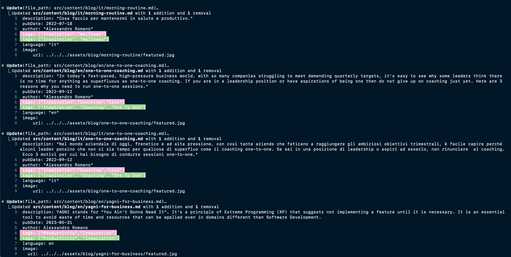

Conosci quei piccoli compiti che continuano a passare da una lista di cose da fare all'altra? Per mesi ho rimandato la sistemazione dei tag inconsistenti del mio blog. Avevo una tempesta perfetta di tag disordinati - formati diversi, abbreviazioni casuali e concetti duplicati tra i post. Lo scorso weekend, finalmente l'ho affrontata, ma con una novità: ho arruolato l'aiuto di Claude, un assistente di programmazione AI.

## Il Problema dei Tag del Mio Blog

Man mano che il mio blog cresceva, il mio sistema di tag diventava sempre più incoerente:

- Formattazione incoerente: `remote-work` vs `Remote Work` vs `remoteWork`
- Concetti sovrapposti: `DX` e `Developer Experience` usati in modo intercambiabile
- Tag abbreviati non ovvi per i lettori
- Traduzioni incoerenti tra le versioni italiane e inglesi dei post

Questo rendeva difficile per i lettori trovare contenuti correlati e complicava la mia gestione dei contenuti.

## Entra Claude Code

[Claude Code](https://www.anthropic.com/claude) è l'assistente di codifica AI di Anthropic. Può analizzare basi di codice, suggerire miglioramenti e implementare modifiche su più file. Ho deciso di vedere se poteva gestire il mio compito di rifattorizzazione dei tag.

Ecco come è andato il processo:

1. **Analisi**: Claude ha scansionato l'intero repository del mio blog, analizzando tutti i post sia in inglese che in italiano per comprendere i modelli di tag esistenti
2. **Piano di standardizzazione dei tag**: Ha identificato le incoerenze e suggerito PascalCase con spazi come il formato migliore
3. **Implementazione**: Claude ha aggiornato tutti i tag dei post del blog in modo coerente
4. **Organizzazione migliorata**: Ha persino creato funzioni di utilità per raggruppare tag correlati

## I Risultati

Ecco come appariva la trasformazione dei tag per alcuni post:

- `["Tech","DX", "Productivity"]` → `["Tech", "Developer Experience", "Productivity", "Tools"]`
- `["Productivity","Async Work"]` → `["Productivity", "Remote Work", "Leadership"]`
- `["Wellness","DX","Tech","Inspiration"]` → `["Wellness", "Developer Experience", "Tech", "Inspiration"]`
- `["Inspiration","Coaching","1to1"]` → `["Inspiration", "Coaching", "One To One"]`

Oltre alla semplice riformattazione, Claude ha suggerito miglioramenti semantici, espandendo le abbreviazioni e garantendo un uso coerente dei tag tra post correlati.

## Oltre la Semplice Risoluzione dei Problemi

La parte più impressionante non è stata solo che Claude ha corretto i tag, ma che ha compreso il contesto più ampio di ciò che stavo cercando di ottenere. Ha individuato schemi che non avevo esplicitamente menzionato e ha suggerito miglioramenti che non avevo considerato.

Il mio preferito è stato quando ha riconosciuto che "DX" significa in realtà "Developer Experience" e ha apportato questo cambiamento in modo coerente in tutti i post, rendendo i miei contenuti più accessibili ai lettori che potrebbero non conoscere tutte le abbreviazioni tecniche.

## Perché Questo È Importante

Dedicare tempo a pulire i tag migliora significativamente l'esperienza utente per i miei lettori. Ora possono:
- Scoprire contenuti correlati più facilmente
- Navigare tra gli argomenti in modo più intuitivo
- Trovare una terminologia coerente tra i post in inglese e italiano

## L'Esperienza di Codifica con l'AI

L'intero processo è sembrato sorprendentemente naturale - come lavorare con un collega molto veloce che non si annoia mai con compiti ripetitivi. Invece di aprire laboriosamente un file dopo l'altro per correggere i tag, ho semplicemente spiegato in linguaggio semplice cosa volevo e ho rivisto i risultati.

Sono rimasto particolarmente colpito da come Claude:
1. Ha capito la struttura della mia codebase senza che io la spiegassi
2. Ha apportato modifiche coerenti in tutti i post (almeno 20 file)
3. Non ha seguito ciecamente le istruzioni ma ha suggerito approcci migliori
4. Ha bilanciato la correttezza tecnica con l'organizzazione concettuale

Mi ha ricordato la mia [transizione da Mac a Windows](/posts/it/mac-to-windows) dove gli strumenti giusti hanno trasformato un cambiamento temuto in qualcosa di effettivamente piacevole.

## Conclusione

Usare Claude Code per rifattorizzare il sistema di tagging del mio blog mi ha risparmiato ore di lavoro noioso. Cosa ancora più importante, ha prodotto un risultato migliore di quello che probabilmente avrei ottenuto manualmente, con utilità aggiuntive per mantenere la coerenza in futuro.

Se hai un compito di rifattorizzazione simile che è rimasto in sospeso nella tua lista di cose da fare, considera di provare un assistente di codifica AI. Sii chiaro su ciò che vuoi, rivedi le modifiche, e potresti rimanere sorpreso dai risultati.

Il futuro dello sviluppo web coinvolge certamente questo tipo di collaborazione uomo-AI, combinando la tua esperienza nel dominio con la capacità dell'AI di gestire compiti ripetitivi con coerenza e attenzione ai dettagli.

> Questo post è stato scritto con l'aiuto di Claude Code, lo stesso assistente AI che mi ha aiutato a rifattorizzare i miei tag. Gli ho semplicemente chiesto di documentare il processo che avevamo appena completato, e ha redatto questo post basato sulla nostra conversazione. Parlando di mangiare la propria cucina!