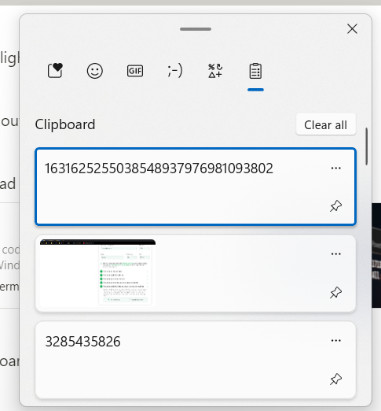
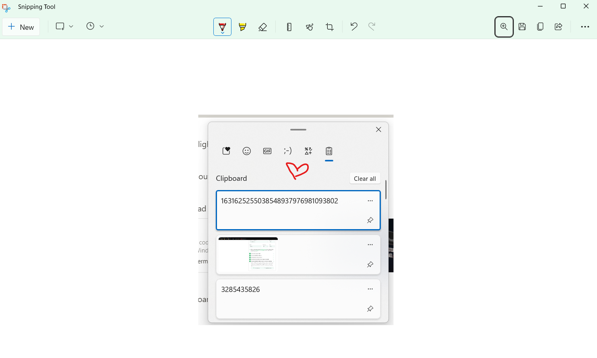
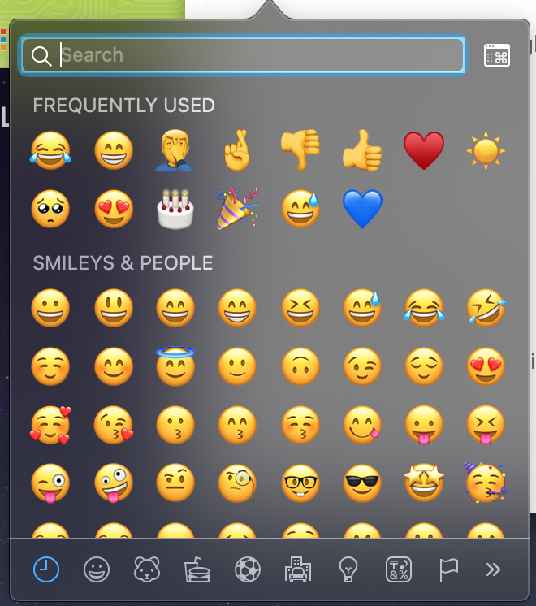
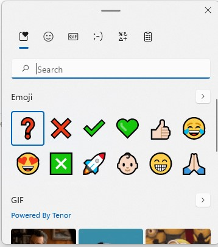

## Ok, ma... perché?

Lavoro per [**AideXa**](https://www.aidexa.it/) come Head of Engineering da ottobre dopo 4 bellissimi anni in [**lastminute.com**](https://lastminute.com/). Come Software Engineer ero così abituato al mio Macbook Pro che pensavo non sarei mai stato in grado di tornare indietro. AideXa, essendo un'azienda che opera in un Ambiente Altamente Regolamentato, ha requisiti stringenti in termini di dispositivi e controllo su di essi, ecco perché abbiamo preferito attenerci a un ecosistema Microsoft con Azure, Active Directory e la suite Office. Questo non significa che non stiamo valutando di introdurre notebook Apple nella nostra policy aziendale qualora si dimostrassero superiori in particolari aree (sì, CPU M1 sto parlando di te).

## Windows è cambiato

È cristallino che Microsoft ha cambiato idea riguardo l'Open Source e il fornire migliori esperienze per gli Sviluppatori. Una delle funzionalità chiave che uso di più è il **Windows Subsystem for Linux** (WSL). Hanno persino rilasciato [**Visual Studio Code**](https://code.visualstudio.com/) che è una perla nel mondo degli Editor di Codice (con superpoteri).

## Spotlight -> Tasto Win

Questa è una rapida Win (gioco di parole voluto) dato che la Ricerca di Windows è molto migliorata: premilo, digita una query e otterrai una ricerca intelligente tra app, file e impostazioni.

## Hot Corner per il logout -> Tasto Win + L

Ero solito spostare il cursore nell'angolo in basso a destra per bloccare in sicurezza il mio Mac. Ora premo Tasto Win + L.

## Terminal/iTerm -> Windows Terminal

Un altro grande esempio di Microsoft che abbraccia l'open source, rilasciando le sue applicazioni e rendendole adatte agli sviluppatori. [**Windows Terminal, Console and Command line**](https://github.com/microsoft/terminal) ha tutte le funzionalità di cui avevo bisogno: funziona bene con il vecchio **cmd**, **Power Shell** e la console **bash** che ottieni installando WSL.

## Maccy/Clip -> Tasto Win + V (Gestore Appunti)

Penso sia la funzionalità che uso di più. Non hai bisogno di alcuna applicazione esterna, è integrata in qualsiasi installazione di Windows 10. Basta tenere premuto Tasto Win + V per ottenere il Gestore degli Appunti che (una volta attivato) può memorizzare infinite voci, inclusi testo, immagini e qualsiasi cosa tu sia in grado di copiare. È semplicissimo rimuovere tutto o solo alcune voci e puoi anche fissare i tuoi preferiti!

## Screenshot -> Tasto Win + Shift + S

Su Mac OS puoi premere Command + Shift + 4 per ottenere lo Strumento di Cattura e selezionare l'area che vuoi catturare. Puoi aggiungere Control alla tua selezione per salvarla negli appunti.
Su Windows, puoi accedere alla stessa funzionalità premendo Tasto Win + Shift + S. Questa è ancora più potente perché ti permette di modificare rapidamente lo screenshot prima di salvarlo, come ad esempio aggiungere dei cerchi rossi intorno alle informazioni importanti.

## Selettore Emoji -> Tasto Win + . (punto)

Mentre su Mac OS puoi premere Command + Control + Barra spaziatrice per aprire il selettore emoji

Su Windows, puoi accedere a una versione ancora migliore (include anche la ricerca GIF) premendo Tasto Win + . (punto)

