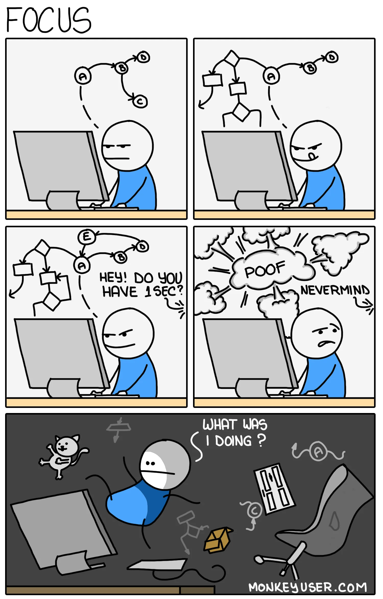
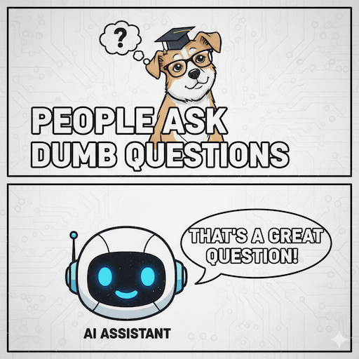

Oooooh, è sabato pomeriggio e dopo un bel pranzo a base di spaghetti allo scoglio io e mia moglie mettiamo i bimbi a nanna. Mi aspettano 2 ore ininterrote in cui posso lavorare al mio sito! Peccato che dopo 10 minuti... "Papà, devo fare la cacca!". Fine del mio focus e, fino a qualche mese fa, fine della mia voglia di scrivere codice.

A lavoro non vengo interrotto da frasi simili, ma essendo un Engineering Manager di 3 team, la parte di crescita delle persone occupa la maggior parte del mio tempo, con context switch continui e richieste estemporanee via chat.

Non fraintendermi: __amo il mio lavoro di manager e amo essere padre__. Ma amo anche scrivere codice e progettare software. Tentare di restare sul pezzo come sviluppatore in queste condizioni è una sfida che ho perso continuamente fino a circa un anno fa.

## Sviluppo Assistito dall'AI (no, non faccio _vibe coding_) 🤖

Ho visto con i miei occhi quanto sia importante per un Software Engineer avere dei blocchi di tempo ininterrotti da meeting o altre distrazioni perché scrivere codice richiede la massima concentrazione.

Questo concetto [non è nuovo](https://www.paulgraham.com/makersschedule.html), ma troppo spesso dimenticato soprattutto da chi fissa meeting nel mezzo della mattina o del pomeriggio ([e magari non sono nemmeno efficaci](/posts/it/effective-meetings-agenda)).

Poi è arrivato lo __sviluppo assistito dall'AI__. 

Con la nascita di Emma ho sfruttato il mio mese di congedo parentale per [rifare questo sito](/posts/it/about-this-site) usando Astro, TypeScript e Docker, tecnologie che conoscevo solo superficialmente o che non usavo attivamente da molto.

Ho iniziato con Cursor anche se ora uso principalmente GitHub Copilot in VS Code in modalità _Agent_.

Ti fermo subito: non faccio _vibe coding_: tutto il codice prodotto è rivisto, a volte modificato, e sempre _compreso_ da me.
Anzi, se qualcosa non è chiaro passo in modalità _Ask_ e continuo a fare domande finché non capisco il perché di certe scelte.

Quindi, Sonnet & Co. non ha "scritto il sito per me"; mi ha permesso di sviluppare con continuità nonostante fossi arruginito sulla sintassi di typescript e non conoscessi Astro e Docker perfettamente. Il tutto mentre un cambio pannolino improvviso o la voglia di giocare con l'altro mio figlio interrompevano il flusso di lavoro.

## Mi sembra di programmare in linguaggio "Inglese" ✍️

Con questi strumenti ho avuto un incredibile AHA Moment quando ho inserito i miei prompt con la mia voce grazie all'icona del microfono in VS Code.

> "Voglio realizzare una sezione del sito in cui elenco i miei post più recenti da X. La chiamata alle API deve avvenire lato server quindi la pagina in cui uso questo componente deve essere Server-side rendered. Dividi le respinsabilità in una funzione che si occupa della chiamata REST, una che applica uno strato di Cache e una che adatta i dati per il rendering in un componente di mera presentazione senza logica. Aspettati di ricevere l'API key come secret dall'environemnt. Scrivi unit tests per questi componenti. Fammi domande di chiarimento se ti servono più dettagli."

Questo è un esempio di prompt simile a quelli che uso (anche se recentemente ho aggiunto un template nelle [copilot-instructions.md](https://github.com/aleromano92/aleromano.com/blob/main/.github/copilot-instructions.md)).

Io rimango il massimo conoscitore del sistema: guido il design, chiedo di applicare certi design pattern, comunico i requisiti funzionali e cross-funzionali. Lancio il prompt e vado a fare quello che il mio team o la mia famiglia necessitano.
Quando torno, ritrovo il *diff* pronto e posso validare rapidamente se l'output rispetta l'intenzione, altrimenti rifinisco il prompt oppure faccio piccole modifiche manuali.

A tutti gli effetti invece di dare in input al "computer" linguaggio typescript, sto scrivendo in un __linguaggio ancora di più alto livello__: l'inglese.

Ovviamente poi NON genero i messaggi di commit con AI, ma scrivo io il *perché* ([qui ne spiego l'importanza](/posts/it/git-commits-why)) della modifica.

## ~~Prompt~~ Context Engineering: è come lavorare con un Junior 🎯

Credo che il termine "prompt engineering" sia fuorviante: non stai "ingegnerizzando" un prompt, stai __fornendo contesto__ a un assistente che deve aiutarti a realizzare un compito complesso.
E onestamente non è così diverso da quello che fai quando assumi una persona nuova, in particolare se è junior, nel chiedere loro di sviluppare le prime features:

- fornisci quanto più contesto di business per fare in modo che le decisioni da prendere siano allineate agli obiettivi
- fornisci esempi di attività simili come Merge Requests passate o parti di codice da cui prendere ispirazione
- chiedi di procedere a piccoli step così da poter correggere la rotta se necessario
- resti aperto a spiegare ulteriormente o chiarire eventuali dubbi rimasti

La __qualità dell'output__ dipende dalla bravura di chi esegue il task, ma anche da come viene fornito il contesto: come per i modelli di machine learning, _garbage in = garbage out_.

## Rischi e Caveat ⚠️

Non credo che __"ho copiato e incollato da StackOverflow"__ sia molto diverso da __"l'AI ha scritto il codice per me"__. La vera differenza sta sempre nel _tuo grado di comprensione_ del codice incollato (o generato).
Se prima con alcune domande in StackOverlflow c'era il rischio di ricevere risposte maleducate, ora puoi davvero sfruttare l'LLM di turno per farti spiegare il perché di ogni scelta. E stai sicuro che ti dirà sempre che è una bella domanda!
Non era sicuro incollare codice senza capirlo prima, non è sicuro fare vibe-coding ora.

C'è poi chi dice di essere preoccupato dal fatto che scrivendo meno codice si perda la _memoria muscolare_ in particolare sulla sintassi. 
Questo è potenzialmente vero, così come è vero che da quando esiste Google Maps le nostre abilità di orientamento sono peggiorate. Ma non per questo smettiamo di usare le mappe digitali, perché il beneficio complessivo supera di gran lunga il costo.

E poi diversi studi hanno confermato che [l'apprendimento maggiore si ha scrivendo a mano](https://pmc.ncbi.nlm.nih.gov/articles/PMC11943480/), eppure non vedo (più) nessuno scrivere i programmi sui fogli protocollo come alle superiori! :smiley:

Ovviamente è importante essere consapevoli di quanto siamo già dipendenti da questi strumenti. Io stesso, se venissi privato dell'AI già oggi, avrei difficoltà a essere produttivo come lo sono ora.

### Se sei un Junior 👶

Per chi è all'inizio, l'abuso di AI è un rischio strategico. Se non hai sedimentato i concetti di base (strutture dati, complessità, cicli di vita di una richiesta web, concorrenza, gestione degli errori), l'AI ti farà "andare veloce" su una strada di cui non hai letto i cartelli. A lungo termine rischi:

- Difficoltà a debuggare quando l'AI non è attorno
- Mancanza di *taste* architetturale (sapere cosa è troppo complesso)
- Dipendenza da prompt generici che generano soluzioni mediocri

Suggerimento: alterna blocchi assistiti a blocchi "manuali" dove ricrei a mano piccole funzioni già viste. E leggi il codice generato come materiale di studio, non come magia.

## Conclusione 💡

Il vero beneficio è emotivo: anche con agenda piena, posso toccare il mio progetto quasi ogni giorno. Questo crea un senso di continuità che alimenta motivazione e identità tecnica. Senza AI probabilmente avrei ridotto drasticamente l'investimento.

Lo sviluppo assistito dall'AI mi permette di praticare software design in condizioni sub-ottimali di tempo e concentrazione. **La leva non è scrivere meno pensiero; è proteggere il pensiero dalla frizione meccanica.**

Se hai blocchi di tempo frammentati, prova un approccio intenzionale: micro-obiettivi, prompt ricchi di contesto, revisione critica, commit che comunicano il perché. Ma se sei nelle fasi iniziali della carriera, dosa l'AI: costruire fondamenta solide resta l'asset più difendibile nel lungo periodo.

