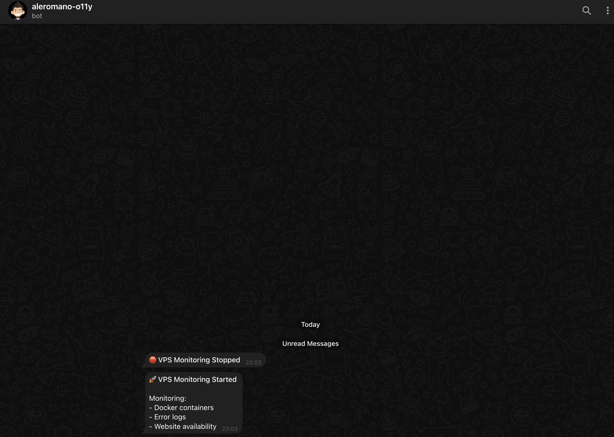
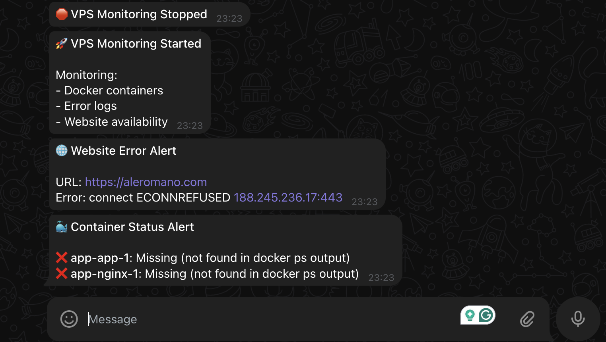

Creare un sito web personale è solo l'inizio. Mantenerlo funzionante senza problemi è la vera sfida. L'ho imparato a mie spese: non c'è niente di più frustrante che scoprire che il tuo sito è stato offline per ore (o giorni!) perché non avevi un sistema di monitoraggio. 🤦‍♂️

Voglio condividere la soluzione di monitoraggio light che ho implementato per il mio sito web personale. È semplice, efficace e non richiede strumenti costosi o configurazioni complesse.

## Perché Non Avevo Bisogno di un Monitoraggio Enterprise 🔍

Per siti web personali o piccoli progetti, quelle sofisticate soluzioni di monitoraggio enterprise che costano centinaia di euro al mese sono eccessive. Ma hai comunque bisogno di sapere quando qualcosa si rompe. La chiave è trovare il giusto equilibrio.

Il mio approccio si concentra su tre aspetti critici:

1. **Monitoraggio dello Stato dei Container**: Docker sta eseguendo i miei container? 🐳
2. **Rilevamento degli Errori nei Log**: Ci sono errori nascosti che dovrei conoscere? 📋
3. **Disponibilità del Sito Web**: I visitatori possono effettivamente vedere il mio sito? 🌐

Questo approccio leggero mi dà tranquillità senza la complessità di soluzioni più sofisticate.

## La Soluzione: Un Semplice Daemon Node.js ⚙️

Ho creato un daemon Node.js che viene eseguito come servizio systemd sul mio VPS. Esegue controlli regolari e invia notifiche tramite Telegram quando vengono rilevati problemi.



### Componenti Chiave

#### 1. Monitoraggio dello Stato dei Container

Lo script controlla regolarmente lo stato dei container Docker utilizzando il comando `docker ps`. Se un container monitorato smette di funzionare, ricevo immediatamente un avviso:

```javascript
const checkContainerStatus = () => {
    exec('docker ps -a --format "{{.Names}}|{{.Status}}"', (error, stdout, stderr) => {
        // Elabora gli stati dei container e invia avvisi per quelli fermi
    });
};
```

#### 2. Rilevamento degli Errori nei Log

Il daemon analizza i log Docker alla ricerca di messaggi di errore, eccezioni ed errori fatali. Questo mi aiuta a individuare problemi prima che si aggravino:

```javascript
const checkDockerLogs = () => {
    // Per ogni container
    exec(`docker logs --since ${since} ${containerName} 2>&1 | grep -i "error\\|exception\\|fatal"`, (error, stdout, stderr) => {
        // Invia avvisi se vengono trovati errori
    });
};
```

#### 3. Controlli di Disponibilità del Sito Web

Richieste HTTP regolari verificano che il mio sito web sia accessibile e risponda correttamente:

```javascript
const checkWebsite = () => {
    const request = https.request(options, (response) => {
        const responseTime = Date.now() - startTime;

        if (response.statusCode >= 200 && response.statusCode < 400) {
            log(`Il sito web è attivo. Stato: ${response.statusCode}, Tempo di risposta: ${responseTime}ms`);   
            // ...
    
    // Gestisce timeout ed errori
};
```

### Notifiche via Telegram

Tutti gli avvisi vengono inviati a Telegram, così ricevo notifiche in tempo reale sul mio telefono o desktop:

```javascript
const sendTelegramNotification = async (message) => {
    const { botToken, chatId } = CONFIG.telegram;
    const url = `https://api.telegram.org/bot${botToken}/sendMessage`;

    // Invia messaggio HTML formattato a Telegram
};
```

## Il Monitoraggio in Azione nel Mondo Reale 🚨

Quando tutto funziona senza problemi, il daemon esegue i suoi controlli silenziosamente in background. Ma quando qualcosa va storto—come quando i container Docker si fermano—il sistema entra in azione:



In questo esempio:

1. Il sistema di monitoraggio ha rilevato che i container Docker erano fermi
2. Ha immediatamente inviato una notifica con dettagli su quali container erano interessati
3. Ha anche rilevato che il sito web era irraggiungibile di conseguenza
4. La formattazione HTML rende gli avvisi facili da leggere a colpo d'occhio

Questo feedback in tempo reale mi permette di risolvere rapidamente i problemi, spesso prima che i visitatori se ne accorgano.

## Perché Questo Approccio È Sufficiente per Me ✅

### 1. Focalizzato su Ciò che Conta

La mia soluzione copre tutti questi aspetti senza complessità inutili.

### 2. Basso Consumo di Risorse

Il daemon di monitoraggio utilizza risorse CPU e memoria minime, rendendolo perfetto per l'esecuzione insieme al mio sito web sullo stesso VPS senza influire sulle prestazioni.

### 3. Zero Dipendenze Esterne

A differenza delle soluzioni di monitoraggio SaaS, questo approccio non dipende da servizi esterni che potrebbero introdurre costi aggiuntivi o punti di guasto. Tutto viene eseguito sulla mia infrastruttura.

### 4. Notifiche Immediate

Quando qualcosa va storto, lo so immediatamente attraverso le notifiche Telegram, permettendomi di affrontare i problemi tempestivamente.

### 5. Facile da Estendere

Il design modulare rende facile aggiungere controlli aggiuntivi o modificare quelli esistenti man mano che le mie esigenze si evolvono.

## Sfide di Implementazione e Soluzioni 🛠️

Durante l'implementazione, ho incontrato e risolto diverse sfide comuni:

### 1. Logging Duplicato

Inizialmente, ho notato voci di log duplicate perché systemd stava reindirizzando sia stdout che stderr allo stesso file di log. Ho risolto modificando la funzione di logging:

```javascript
const log = (message, level = 'INFO') => {
    // Logga sulla console solo se non stiamo anche loggando su un file
    if (!CONFIG.logFile || process.env.NODE_ENV === 'development') {
        console.log(logMessage);
    }
    
    // Logga su file se specificato
    if (CONFIG.logFile) {
        fs.appendFileSync(CONFIG.logFile, logMessage + '\n');
    }
};
```

### 2. Problemi di Timeout del Sito Web

Ho migliorato il controllo del sito web per gestire i timeout in modo più elegante e ho aggiunto un controllo di fallback utilizzando curl per verificare se il problema fosse con il mio monitoraggio o con il sito web stesso:

```javascript
request.on('timeout', () => {
    // Prova un semplice comando curl per vedere se il sito web è raggiungibile
    exec(`curl -s -o /dev/null -w "%{http_code}" -m 10 ${CONFIG.website.url}`, (error, stdout, stderr) => {
        // Confronta i risultati e invia la notifica appropriata
    });
});
```

### 3. Formattazione HTML nelle Notifiche

Ho risolto i problemi con la formattazione HTML nei messaggi Telegram configurando correttamente la richiesta API:

```javascript
const postData = new URLSearchParams({
    chat_id: chatId,
    text: message,
    parse_mode: 'HTML'
}).toString();
```

## Installazione e Configurazione 📦

La soluzione include uno script di installazione che:

1. Verifica la presenza di Node.js e lo installa se necessario
2. Richiede il token del bot Telegram e l'ID della chat
3. Configura un file di log con le autorizzazioni appropriate
4. Crea e configura un servizio systemd
5. Avvia il daemon di monitoraggio

Questo rende la distribuzione semplice anche se non sei un esperto di Linux.

## Ottieni la Soluzione Completa 📂

La soluzione completa, inclusi lo script di monitoraggio, lo script di installazione e la documentazione, è disponibile sul mio repository GitHub. Sentiti libero di usarla, farne un fork o adattarla alle tue esigenze:

[github.com/aleromano92/aleromano.com/tree/main/scripts/observability](https://github.com/aleromano92/aleromano.com/tree/main/scripts/observability)

Ho reso tutto open source in modo che tu possa beneficiare della mia esperienza ed evitare le stesse sfide che ho affrontato. Se hai miglioramenti o suggerimenti, le pull request sono benvenute!

## Conclusione

L'obiettivo dell'osservabilità per un sito web personale non è raccogliere ogni possibile metrica, ma assicurarsi di sapere quando qualcosa richiede la tua attenzione. Questa soluzione raggiunge questo obiettivo in modo elegante ed efficiente. 🎯
