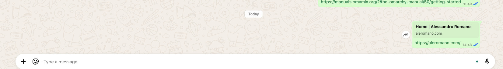

As you can see from the screenshot, there isn't much information automatically shared on whatsapp and similar when I paste my website link.

It should be about metadata and stuff like that.

This is even more relevant for blog posts, as they often contain rich content that could be summarized or previewed in a more engaging way.

Please, guide me into defining proper meta settings for both pages and blog posts.